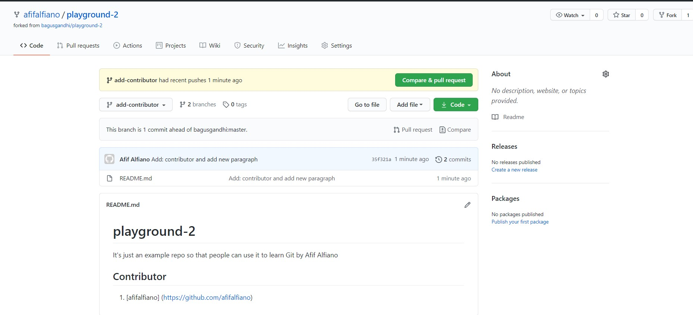

# Kolaborasi Git dan Github

Pada bab kolaborasi ini saya berkolaborasi dengan teman seangkatan saya dan sejurusan juga. Jadi saya melakukan fork pada project yang telah teman saya buat.

1. Saya melakukan fork project playground-2 dari user bagusgandhi dengna cara mengeklik tombol fork yang berada di pojok kanan atas.

Kemudian tunggu proses fork sampai selesai 

2. Jika proses fork sudah berhasil maka otomatis di repository kita terdapat project tersebut. 

3. Selanjtnya kita lakukan clone project yang telah kita fork tadi

    
4. Kemudian untuk memastikan clone dari mana bisa kita cek dengan perintah git remote –v 

    
5. Kemudian tidak lupa untuk melakuakn remote terhadap project master asli dari bagusgandhi supaya jika sewaktu-waktu terdapat perubahan tinggal kita lakukan fetch pada remote upstream tersebut.

    
6. Kemudian mengedit file README.md seperti berikut ini.

    
7. Setelah kita buat branch baru untuk menampung perubahan file tersebut dengan menjalankan perintah git checkout –b add-contributor. Kita melakukan git add –A dang it commit –m “message” ketika berada di branch add-contributor. Kemudian kembali lagi ke branch master dan kita push branch tersebut dengan menjalankan perintah git push origin add-contributor.

8. Kemudian kita cek diakun github saya pada branch add-contributor dan tampilannya seperti berikut ini.

9. Supaya perubahan saya bisa terupdate di masternya bagusgandhi maka saya dapat melakukan sebuah pull request atau permohonan perubahan pada file tertentu. Untuk melakukannya tinggal klik compare & pull request.

Isikan sebuah pesan kalau kita ingin melakukan pull  request dan jika sudah langsung saja klik Create pull request.
    
10. Nah jika tampilannya sudah seperti ini kita tinggal menunggu review dari ownernya yaitu bagusgandhi.

11. Berikut ini tampilan ketika pull request kita disetujui oleh owner project tersebut.

12. Tapi kondisi di local kita khususnya di branch master belum terupdate nih. Nah kita bisa melakukan fetch upstream yang mana mengambil perubahan pada branch master miliki bagusgandhi atau pemiliki project ini.

Jika sudah berhasil fetch tinggal lakukan merge saja dengan menjalankan perintah git merge upstream/master. Artinya kita menggabungkan master dari upstream ke master local saya. Jika sudah terupdate langsung saja lakuka push ke origin master. Sekiranya branch add-contributor tidak dibutuhkan bisa dihapus saja dengan menjalankan perintah git branch –D add-contributor.

