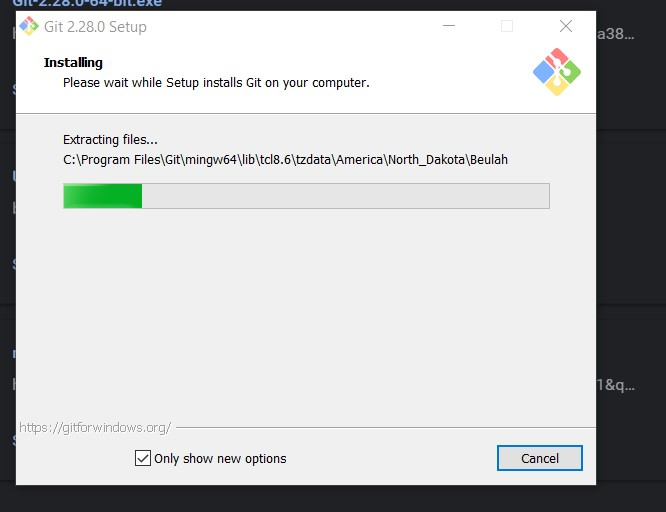
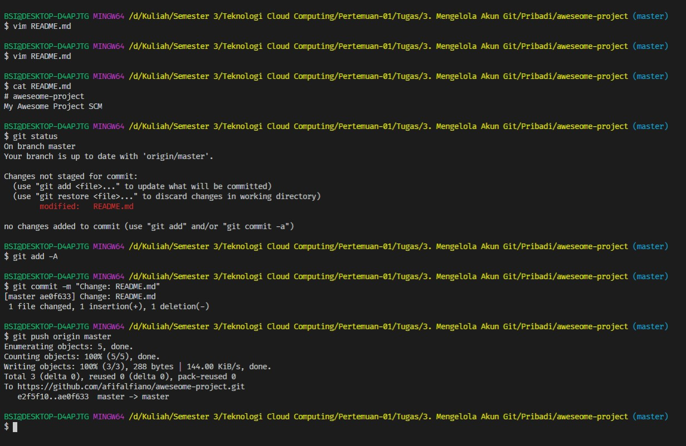
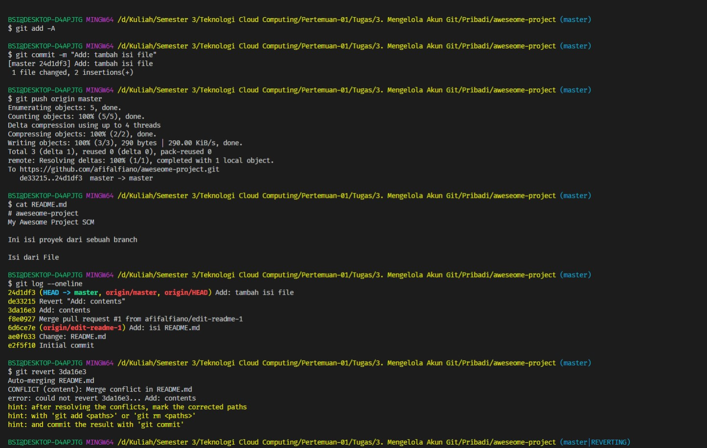

# Install Git

## Windows

1. Untuk pengguna windows langsung saja download installer git melalui link git-scm.com/download

2. Tunggu proses download sampai selesai dan pastikan koneksi internet lancar.

3. Kemudian langsung saja jalankan installer git tersebut.

4. Tunggu proses installer sampai selesai

5. Setelah selesai langsung saja buka aplikasi Git Bash yang shortcutnya terdapat pada windows.

6. Seperti ini tampilan git bash. Sebenarnya tidak ada perbedaan dengan cmd hanya saja syntax dan aturan git bash itu menggunakan dari linux jadi kita seperti menggunakan operating system linux. Untuk mengecek versi langsung saja jalankan perintah git –version.

7. Nah, untuk tampilan Git Bash GUI nya seperti ini, tapi saya jarang atau bahkan tidak pernah menggunakan versi GUInya dari git bash.

## Konfigurasi Git
Disini saya mencoba konfigurasi secara local, bukan global.

1. Buka terlebih dahulu git bash

2. Selanjutnya jalankan perintah git config –local user.name “afifalfiano” . Fungsinya adalah untuk menambahkan user pada konfigurasi tapi sifatnya hanya local project saja, untuk menggunakan yang global tinggal ganti –local menjadi –global.

3. Selanjutnya jalankan perintah git config –local user.email “afifalfiano2@gmail.com”. Sama seperti penjelasan sebelumnya saya menggunakan konfigurasi untuk local saja.

4. Untuk melihat konfigurasi secara penuh tinggal jalankan perintah git config –list untuk versi globalnya sedangkan untuk versi local tinggal jalankan perintah git config –local –list.

## Mengelola Akun Git Pribadi
1. Membuat project baru di akun github saya.

    
2. Kemudian lengkapi field sesuai keinginan.

3. Setelah berhasil buat saya lakukan clone repository tersebut.

    
4. Selanjutnya kita mencoba syntax git seperti git add, git status, git commit dan git push.

    
Penjelasan:
Saya sudah memiliki file README.md hasil generate project dari github. Kemudian saya edit menjadi seperti diatas. Untuk mengecek apakah sudah masuk ke staging area apa belum bisa jalankan perintah git status. Kemudian untuk memindahkan file yang berubah tadi ke staging area tinggal jalankan perintah git add –A dan setelah itu untuk mengcommit perubahan bisa jalankan perintah git commit –m “message” . Jika semua tahapan sudah berhasil maka tinggal kita push ke master untuk mengupdate yang ada di akun github saya. Karena jika tidak melakukan push maka perubahan hanya ada di local saja.

5. Kemudian saya cek di github dan ternyata sudah terupdate. Bisa juga dengan mengecek history commit.

    
6. Selanjutnya saya mencoba untuk mengedit file dengan branch yang lain atau bukan master.

    

    
Penjelasan:
Untuk membuat branch baru dan pindah ke branch baru tersebut dalam satu perintah bisa jalankan perintah git checkout –b edit-readme-1 . Selanjutnya edit file README.md menjadi sedemikian rupa. Selanjutnya kita cek seperti biasa menggunakan git status. Jika belum masuk ke staging area bisa jalankan perintah git add –A kemudian git commit –m “message”. Sebenarnya untuk melakukan push branching bisa saja sewaktu di branch tersebut tanpa harus checkout ke master tapi untuk memastikan prosesnya berjalan dengan benar kita cek dari master. Ketika berhasil push dan membuat branch baru maka terdapat keterangan [new branch].

7. Kita bisa melakukan pull request atau istilahnya menggabungkan isi dari branch edit-readme-1 ke master dengan persetujuan dari owner project tersebut.

   
   Berikan sebuah pesan dan langsung saja klik create pull request.

   
8. Selanjutnya sambil menunggu kode direview owner, saya coba merge atau menggabungkan branch edit-readme-1 dan master di local saya.

    
Penjelasan:
Pastikan sudah berada dimaster jika ingin merge dari edit-readme-1. Jika sudah langsung saja jalankan perintah git merge edit-readme-1 maka otomatis isi dari edit-readme-1 akan masuk ke master. Kemudian supaya lebih rapi dalam branch bisa dihapus branch-edit-readme-1 karena sudah tidak digunakan dengan perintah git branch –D edit-readme-1. Untuk mengecek ada berapa banyak branch bisa gunakan git branch. Untuk melihat log git bisa gunkan git log atau git log –oneline.

9. Kemudian terjadi suatu kejadian kalau saya salah melakukan perubahan maka kita bisa menjalankan suatu perintah supaya kembali ke kondisi semula.

    
Penjelasan: 
Sebelumnya saya telah membuat branch edit-readme-2 dan melakukan perubahan pada file README.md. Nah saya ingin menghapus perubahan dan branch tersebut. Hal yang harus kita lakukan adalah kembali ke branch master. Kemudian kita hapus terlebih dahulu branch edit-readme-2 dengan menjalankan perintah git branch –D edit-readme-2. Setelah itu supaya kemabali ke kondisi normal tinggal jalankan saja perintah git reset –hard . Maka otomatis akan kembali ke kondisi normal dengan catatan perubahan yang salah itu tidak dicommit.

10. Ketika pull request kita sudah disetuju maka otomatis isi dari branch edit-readme-1 akan dimerge ke master dan tampilannya akan seperti berikut ini

    
11. Untuk mendapatkan perubahan terbaru dari upstream bisa jalankan perintah git pull 

    
12. Selanjutnya kita bisa kembali ke kondisi sebelumnya dengan menggunakan perintah revert.

    
Penjelasan:
Sebelumnya saya sudah mengubah file README.md dengan menambah beberapa paragraph dan melakukan push ke master. Kemudian saya ingin kembali kekondisi commit terakhir. Maka tinggal kita jalankan peirntah git revert HEAD dan otomatis project akan kembali ke commitan sebelumnya. Selanjutnya jangan lupa untuk melakukan push kembali ke master.

13. Kemudian kita juga bisa kembali ke kondisi sebelum commit terakhir menggunakan revert

    

    
Penjelasan:
Saya mengedit file README.md dengan menambahkan beberapa paragraph kemudian melakukan git add dan commit. Tapi saya tidak ingin perubahan ini terjadi dan saya ingin kembali ke kondisi sebelum commit terakhir. Maka kita bisa cek dengan git log –oneline untuk melihat log kita dan tinggal menjalankan perintah git revert –hard HEAD^. Kemudian kita cek lagi file tersebut dan sudah kembali ke kondisi awal.

14. Kemudian kita juga bisa kembali ke kondisi normal berdasarkan kode comit menggunakan revert.

    

    

    
Penjelasan:
Sebelumnya saya menabahkan beberapa tulisan untuk melihat perubahan kemudian melakukan git add, git commit dan git push ke origin master. Selanjutnya untuk kembali ke kondisi berdasarkan kode commit cukup simple. Langsung saja jalankan perintah git revert kode commit. Untuk melihat kode commit bisa jalankan perintah git log –oneline. Kita perlu mengkonfirmasi revert kode commit sudah sesuai apa belum jika sudah langsung saja Ctrl+x supaya bisa melanjutkan langkah selanjutnya.

Tapi terkadang ketika melakukan revert bisa saja terjadi konflik pada kode yang kita tulis. Seperti berikut ini

    
Untuk kembali ke kondisi sesuai dengan kode commit tinggal pilih Accept Incoming Change,  sedangkan untuk tetap berada pada file perubahan terakhir di master bisa pilih Accept Current Change. Jika sudah maka tinggal lakukan save file dan konflik selesai.

    
Jika perubahan sudah sesuai jangan lupa untuk melakukan git add dan git commit.
    
Setelah berhasil melakukan git add dan git commit kita lanjutkan path dari revert tadi menggunakan git revert –continue. Kemudian lakukan langkah seperti sebelumnya yaitu git add –A , git commit “message” dan git push origin master. 

    

    
Untuk memastikan perubahan file sudah benar apa belum bisa melihat dari log yang ada di git atau langsung saja buka file README.md
