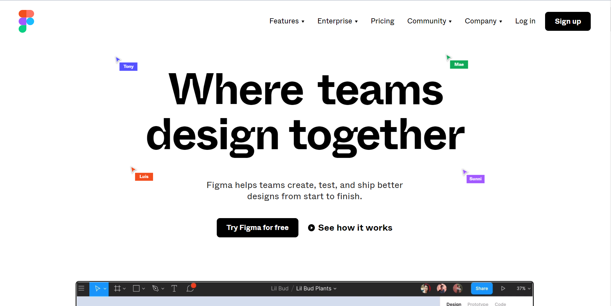
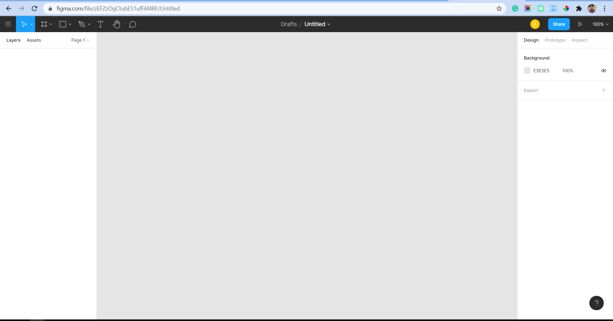
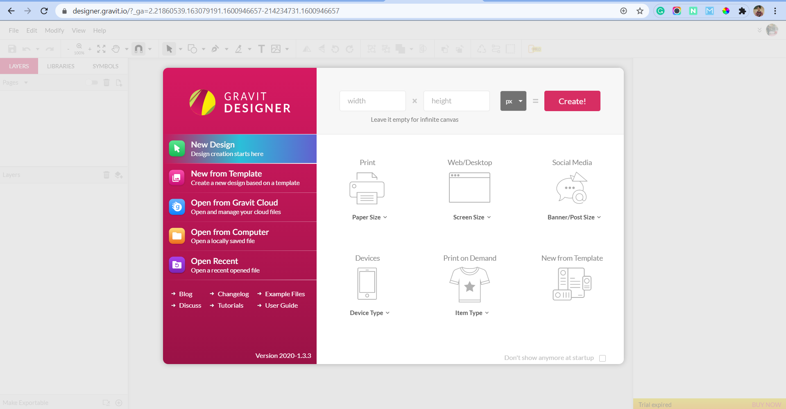
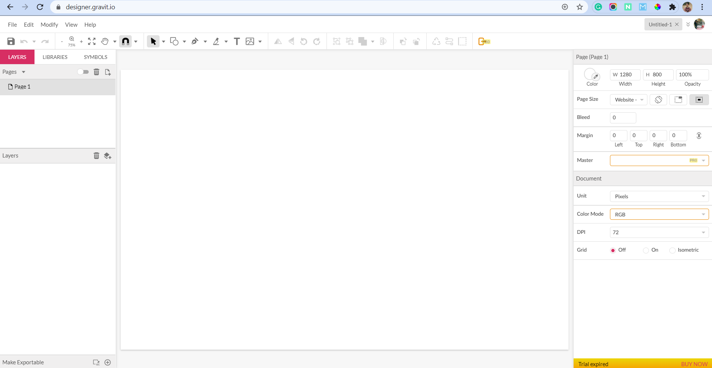
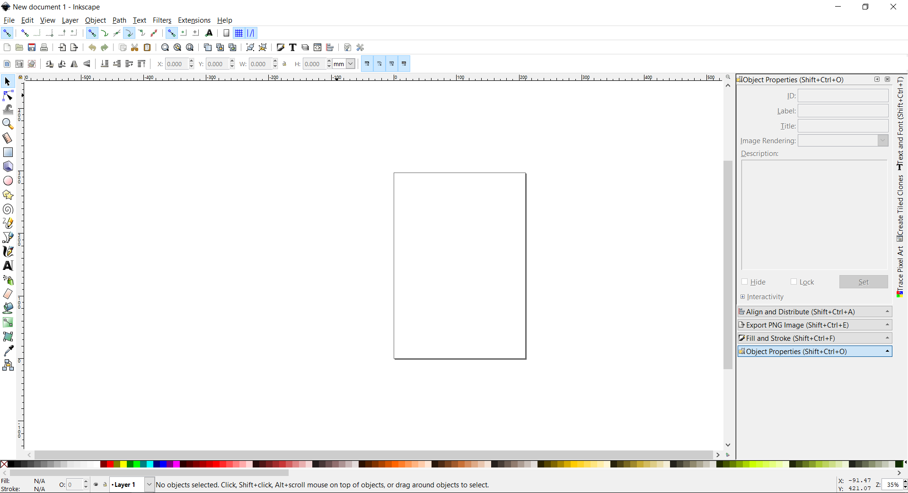
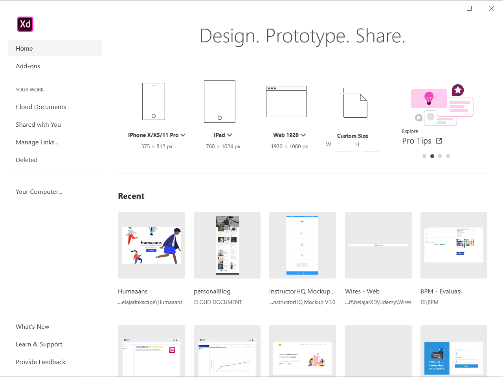
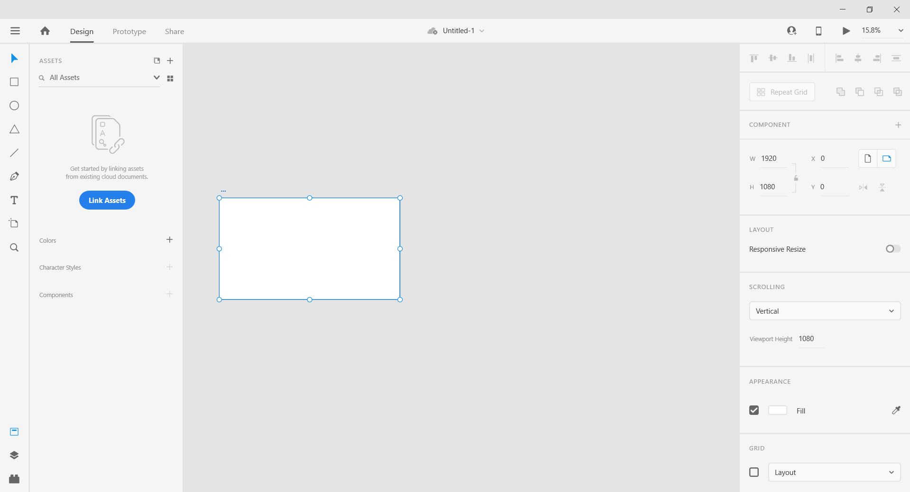

## Layanan SaaS

Berikut ini macam-macam layanan software as a service dan versi offlinenya
## SaaS
### 1. Figma

Figma adalah salah satu design tool dan keunggulan dari Figma adalah web based. Sehingga jika kamu pengguna windows, linux ataupun mac, kamu bisa menggunakan design tool ini tanpa harus menginstall di system operasi terlebih dahulu. 

Fungsi dari software as a service figma ini adalah digunakan untuk mendesain sebuah prototype ataupun desain untuk sebuah project dan memungkinkna untuk berkolaborasi dengan desainer lain. Karena figma ini web based jadi terasa sangat ringan ketika mengoperasikan.

### 2. Gravit

Gravit adalah sebuah software as a service yang fungsinya hampir mirip dengan figma dan digunakan untuk mendesain. Sayangyna untuk menggunakan gravit secara gratis hanya bisa dengan trial saja setelah itu harus berlangganan jika masih ingin mengunakan gravit. Basisnya vector juga untuk gravit ini.

### Non-Cloud SaaS

### 1. Inkscape

Inkscape adalah sebuah software yang digunakan untuk mendesain sesuatu. Basis inkscape adalah vector dan inkscape ini juga gratis tidak ada lisensi karena ini project open source. Pada dasarnya inkscape ini hampir mirip dengan corel draw. Jadi untuk alternative dari corel draw adalah inkscape

### 2. Adobe XD

Adobe XD adalah software yang dikhususkan untuk membuat sebuah desain dan prototype. Secara fungsi adobe xd ini mirip dengan figma tapi masih sangat terbatas. Adobe XD ini juga terbatas untuk penggunaannya secara free yang artinya untuk menggunakan secara full maka harus berlangganan.

