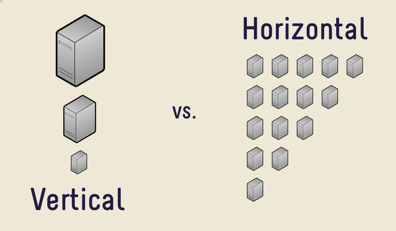

## Rangkuman Software as a Service

SaaS adalah suatu model penyampaian aplikasi perangkat lunak oleh suatu vendor perangkat lunak yang mengembangkan aplikasi web yang diinangi dan dioperasikan untuk digunakan oleh pelanggannya melalui Internet.

### Perbedaan IaaS, SaaS dan PaaS

#### IaaS

Infrastructure as a Service adalah model dimana sumber daya komputasi disediakan secara virtual. Penyedia cloud IaaS dapat memberi Anda seluruh rentang sumber daya yang dibutuhkan untuk suatu perusahaan. Ini menyediakan server, penyimpanan, dan hard drive jaringan. Ini juga menyediakan perawatan dan dukungan. Bisnis dapat memenuhi persyaratan di sana tanpa memasang perangkat keras apa pun. Ini menyediakan sumber daya pada basis outsourcing untuk operasi perusahaan. Ini juga menyediakan ruang pusat data dan komponen jaringan.

Berikut adalah contoh IaaS, Digital Ocean, AWS (Amazon Web Services), Linode, Rackspace, Google Compute Engine, Microsoft Azure, Cisco MetapodSaaS 

#### SaaS

Software as a Service adalah model di mana perangkat lunak digunakan dan dibeli dengan langganan online daripada mendapatkan lisensi, menginstal dan menggunakannya sebagai perangkat lunak desktop. SaaS dihosting secara terpusat. Ini juga disebut "perangkat lunak sesuai permintaan" dan "perangkat lunak plus layanan". Dalam model ini penyedia pihak ketiga menghosting aplikasi dan membuat aplikasi ini tersedia untuk pengguna berlangganan melalui internet. Model ini memberikan akses cepat ke aplikasi web. Pemeliharaan dan dukungan disediakan oleh penyedia layanan. Berikut adalah beberapa contoh SaaS : Google Apps, Salesforce, Hubspot, Zendesk, Slack, Ahrefs, Semrush, Majestic SEO, Drop Box, Mailchimp.

#### PaaS

Platform as a Service adalah model komputasi awan yang menyediakan basis awan tempat Anda dapat menguji dan menjalankan aplikasi Anda. Ini menyederhanakan proses pengembangan perangkat lunak. Pada dasarnya ini adalah model yang menyediakan perangkat keras dan perangkat lunak yang dibutuhkan untuk proses pengembangan aplikasi di internet kepada pengguna. Platform sebagai penyedia Layanan menghosting perangkat keras dan perangkat lunak pada infrastrukturnya sendiri. Berikut adalah beberapa contoh Paa: Google App Enginel, Windows Azure dan AWS Elastic Beanstalk.

### Arsitektur SaaS

Satu versi aplikasi dengan konfigurasi tunggal digunakan untuk semua pelanggan. Aplikasi diinstal pada beberapa mesin untuk mendukung skalabilitas (disebut penskalaan horizontal). Dalam beberapa kasus, versi kedua dari aplikasi diatur untuk menawarkan kelompok pelanggan tertentu dengan akses ke versi pra-rilis aplikasi untuk tujuan pengujian. Dalam model tradisional ini, setiap versi aplikasi didasarkan pada kode unik. Meskipun pengecualian, beberapa solusi SaaS tidak menggunakan multitenancy, untuk mengelola sejumlah besar pelanggan secara hemat biaya. Apakah multitenancy merupakan komponen penting untuk software-as-a-service adalah topik kontroversi.

#### Ada dua jenis utama SaaS:

- SaaS Vertical

Perangkat lunak yang menjawab kebutuhan industri tertentu (misalnya, perangkat lunak untuk perawatan kesehatan, pertanian, real estate, industri keuangan)

- SaaS Horisontal

Produk yang berfokus pada kategori perangkat lunak (pemasaran, penjualan, alat pengembang, SDM) tetapi bersifat agnostik industri.

### Arsitektur Platform SAAS (Software as a Service)

Perangkat lunak telah didistribusikan ke pelanggan di berbagai saluran selama beberapa dekade terakhir. Saluran distribusi yang lebih baru dalam Perangkat Lunak sebagai Layanan (atau SaaS).

Jadi, mengapa Anda ingin menggunakan produk yang dikirimkan "sebagai layanan"?

#### Konsumen

Dari sudut pandang konsumen, produk SaaS adalah salah satu cara termudah untuk menggunakan layanan atau produk digital. Anda cukup mengaksesnya melalui web, membayar layanan, dan menggunakannya! Dalam beberapa tahun terakhir kami telah melihat munculnya ribuan produk SaaS yang ditargetkan untuk konsumen seperti: (Netflix, Microsoft Office 365, Amazon Prime, Indonesia, Facebook, Google Docs, dll)

#### Bisnis

Dari perspektif bisnis, produk perangkat lunak yang diberikan "sebagai layanan" memungkinkan bisnis menawarkan produk mereka dalam skala besar, secara global, sementara juga memungkinkan mereka untuk mempertahankan kendali keseluruhan atas produk mereka. Beberapa manfaat lain dari penerapan arsitektur SaaS dalam bisnis termasuk, namun tidak terbatas pada:

• Mengurangi waktu ke pasar

• Biaya perawatan lebih rendah

• Peningkatan yang lebih mudah

### Fitur Utama dan Manfaat Platform SaaS

Solusi SaaS memiliki fitur yang berbeda dengan yang ada pada aplikasi tradisional yang diinstal di desktop Anda misalnya, berikut adalah beberapa manfaat lain yang dapat dihasilkan dari penerapan produk berbasis SaaS.

#### Kesederhanaan

Aplikasi perangkat lunak yang dirancang sebagai solusi SaaS biasanya diakses melalui web melalui berbagai jenis perangkat. Kemajuan dalam bahasa pemrograman sisi klien seperti JavaScript telah menghasilkan antarmuka web yang lebih intuitif dan dengan demikian, membuat penggunaan aplikasi yang dikirimkan melalui internet mudah digunakan seperti rekan desktop mereka.

#### Ekonomis

Model pembayaran biaya subskrip bulanan atau tahunan memudahkan bisnis untuk menganggarkan, menggabungkan ini dengan biaya penyiapan infrastruktur nol, mudah untuk melihat bagaimana memilih untuk menggunakan solusi SaaS dapat menghemat uang bisnis.

#### Keamanan

Keamanan merupakan aspek penting dari solusi pengembangan perangkat lunak dan platform SaaS juga demikian. Sebagai konsumen aplikasi yang dirancang menggunakan SaaS, Anda tidak perlu mengkhawatirkan cara penguncian data Anda. Dipegang dengan aman di awan!

#### Kesesuaian

Dengan penginstalan perangkat lunak tradisional, pembaruan dan tambalan terkadang memerlukan banyak waktu dan uang. Hal ini terutama berlaku di perusahaan. Selain itu, perbedaan versi antara anggota tim dari tenaga kerja Anda dapat menyebabkan masalah kompatibilitas dan bahkan lebih banyak waktu yang terbuang. Dengan SaaS, pelanggan dapat dengan mudah masuk ke layanan yang sudah ditingkatkan.

#### Kemampuan SaaS

Platform SaaS memiliki beragam kemampuan. Apalagi jika ditambah dengan penawaran cloud lainnya seperti IaaS (Infrastructure as a Service) dan PaaS (Platform as a Service).

### Membangun Aplikasi SaaS berbasis Cloud.

Bisnis SaaS adalah industri yang tumbuh sangat cepat dan menarik lebih banyak orang dan perusahaan. Organisasi-organisasi ini lebih dan lebih aplikasi mengambang di awan. Penskalaan di cloud juga memiliki beberapa manfaat dan risiko penting. Untuk membuat layanan SaaS berbasis cloud hal pertama yang dibutuhkan adalah:

#### 1. Bahas pemrograman apa yang akan digunakan

Membangun produk untuk cloud berarti membangun produk dengan bahasa pemrograman modern. Selain kemampuan dan keterampilan pribadi, pilihan bahasa pemrograman Anda akan dipengaruhi oleh kemungkinan setiap bahasa. Ada berbagai bahasa pemrograman (modern) di luar sana sehingga sulit untuk memilih yang tepat.

#### 2. Database yang tepat untuk digunakan

Untuk membuat layanan SaaS berbasis Cloud dirokemendasikan menggunakan database dokumen daraipada menggunakan database dengan konsep tradisional. Mengapa memilih database berorientasi dokumen? Database dokumen mendapatkan informasi tipenya dari data itu sendiri. Jadi setiap contoh data dapat berbeda dari yang lain. Ini memungkinkan lebih banyak fleksibilitas, terutama saat menghadapi perubahan. Dan itu sering kali mengurangi ukuran database.

#### 3. System queuing

Dikenal sebagai teknologi Message Queuing (MSMQ), ini memungkinkan aplikasi web untuk berjalan pada waktu yang berbeda dan untuk berkomunikasi dengan berbagai integrasi pihak ketiga / API / dan layanan lainnya secara asinkron. Sebuah pesan (misalnya kueri yang meminta layanan pihak ketiga melalui API) ditempatkan ke antrean. Itu disimpan di sana sampai penerima mengambilnya. Antrian pesan memiliki batasan terkait ukuran dan jumlah data yang dikirimkan dalam antrian. Hal terbaik tentang sistem antrian modern adalah sistem ini dapat diskalakan dengan mudah. Dapat menggunakan RabbitMQ, AWS & EC2 dan peyimpnannya menggunakan web storage S3.

#### 4. Content delivery network

Content delivery network (CDN) pada dasarnya adalah sistem server terdistribusi yang memungkinkan Anda menyajikan konten kepada pengguna aplikasi Anda dengan kinerja tinggi dan ketersediaan tinggi.

**Sumber**
- https://www.quora.com/What-is-the-difference-between-IaaS-SaaS-and-Paas

- https://hackernoon.com/saas-software-as-a-service-platform-architecture-757a432270f5

- https://www.devteam.space/blog/saas-software-as-a-service-platform-architecture/

- https://usersnap.com/blog/cloud-based-saas-architecture-fundamentals/
