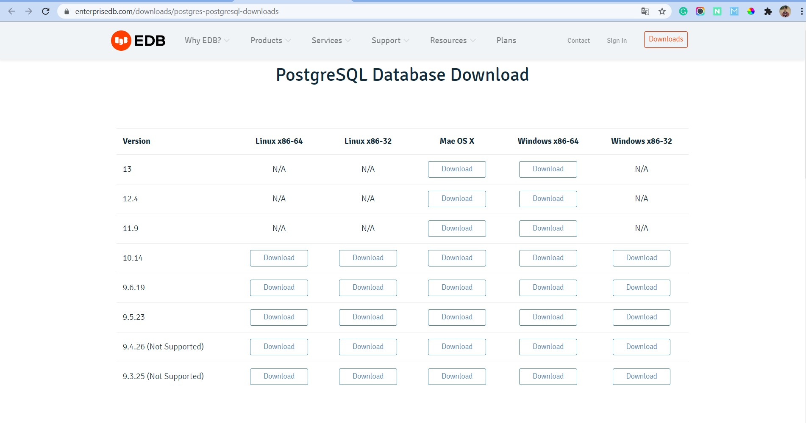
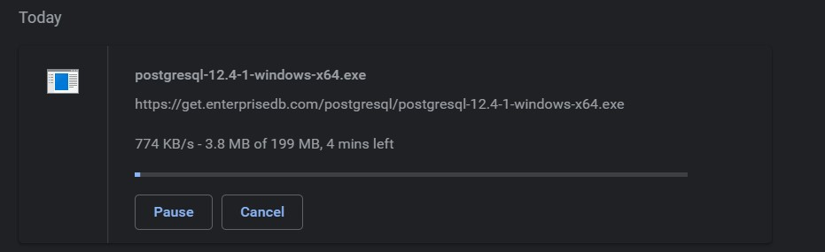
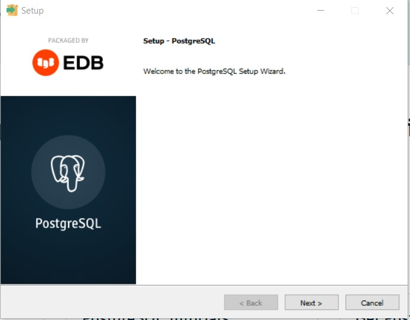
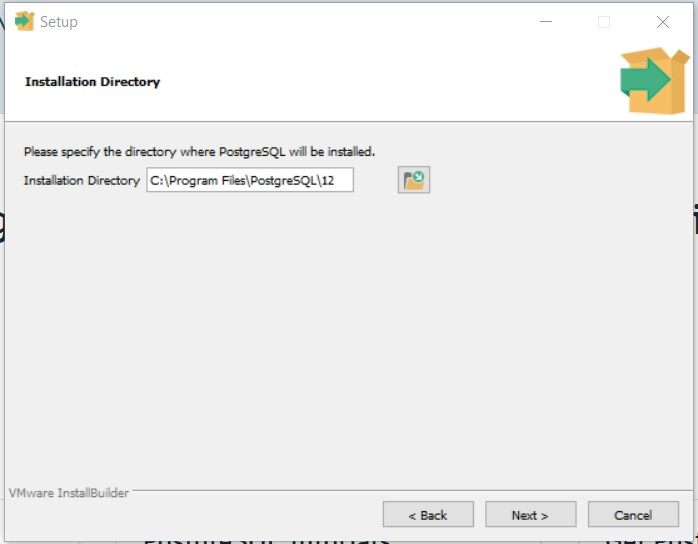
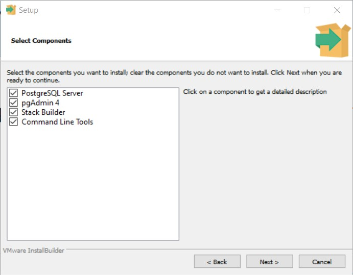
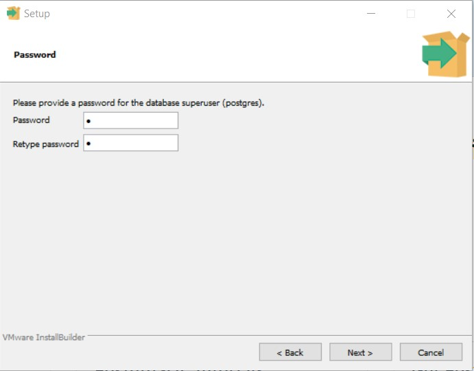
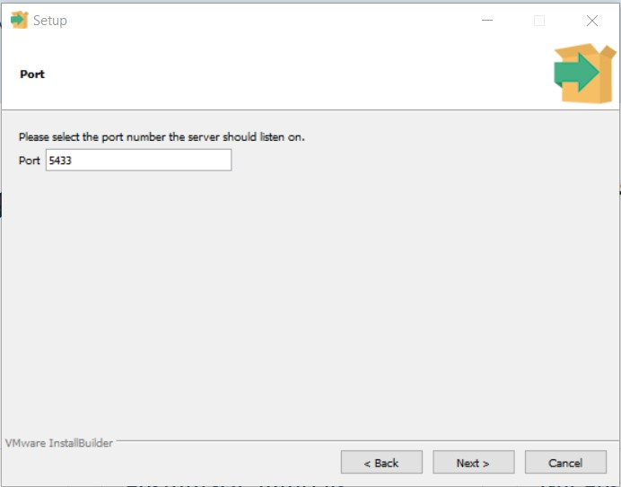
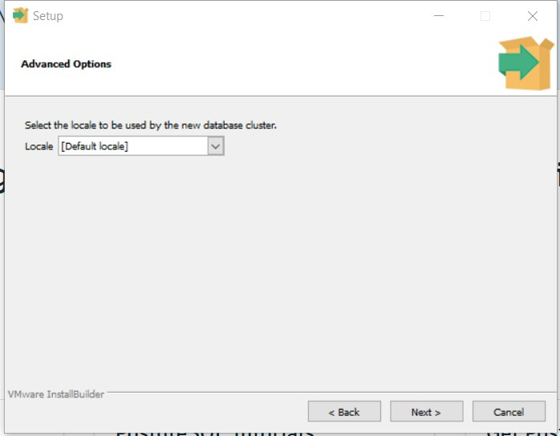
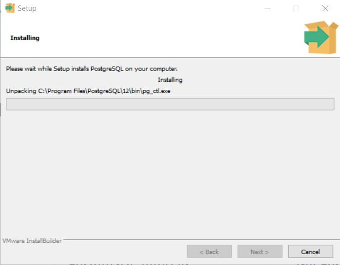
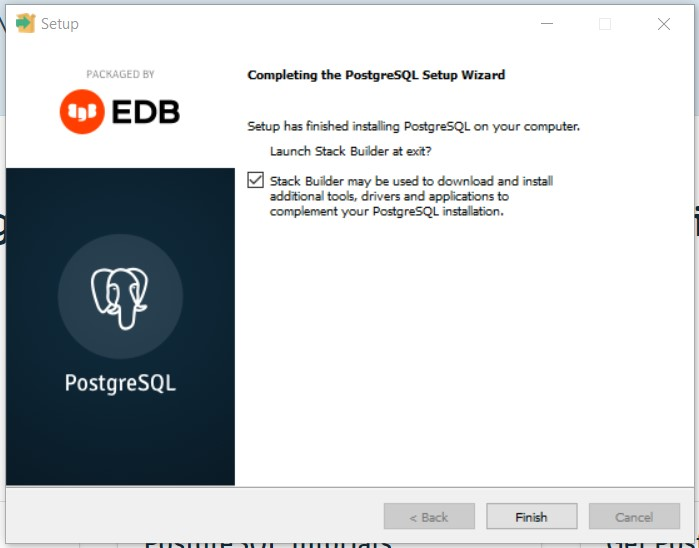

## Install Postgresql

Platform heroku menggunakan database postgresql maka sangat disarankan kalau kita menginstall software tersebut di local komputer kita.

#### 1. Download

Seperti biasa untuk menginstall suatu program pastikan kita sudah mempunyai installernya. Jika belum bisa download di wesbite resimnya.

Tunggu proses download sampai selesai

#### 2. Install

Kemudian buka installer tersebut dan jalankan.

Pastikan direktori atau folder sudah sesuai dan klik next

Kemudian pada pilih components biarkan default saja dan next.

Kemudian untuk directory biarka default saja dan next.

Selanjutnya untuk password database postgresql pastika kita tidak lupa dan jika sudah klik next

Kemudian untuk port biarkan default saja tapi kita juga bisa mengedit sesuai keinginan kita

Kemudian untuk selanjutnya biarkan default dan next

Nah, tinggal tunggu proses install selesai.

#### 3. Selesai

Selamat postgresql teman-teman sudah bisa digunakan

