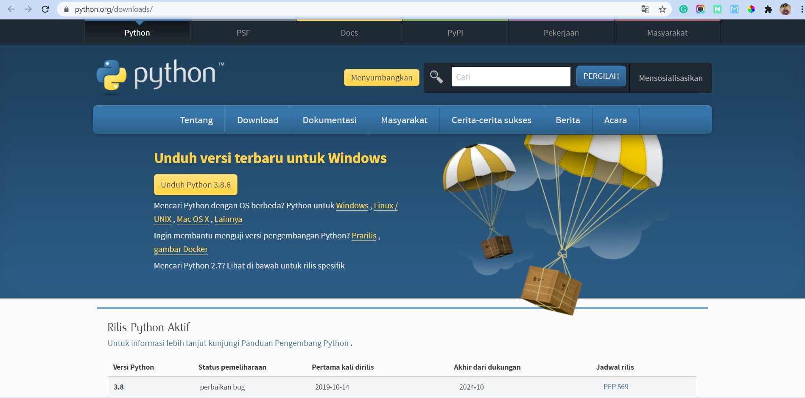
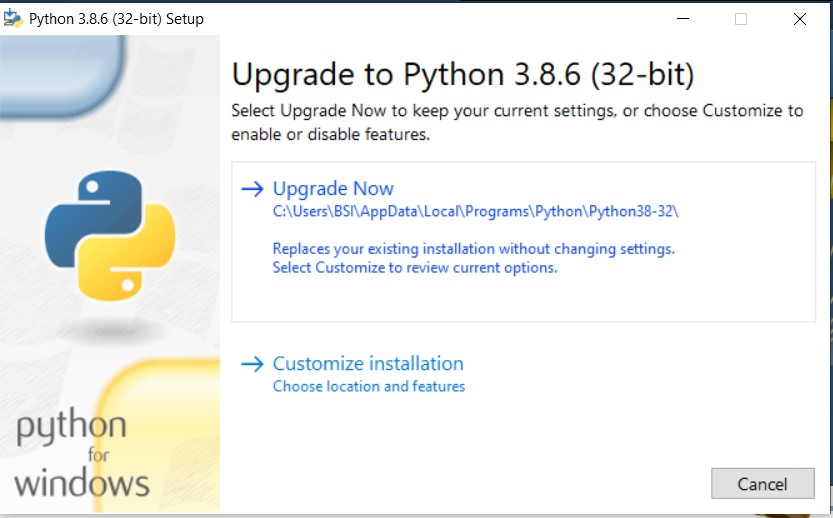
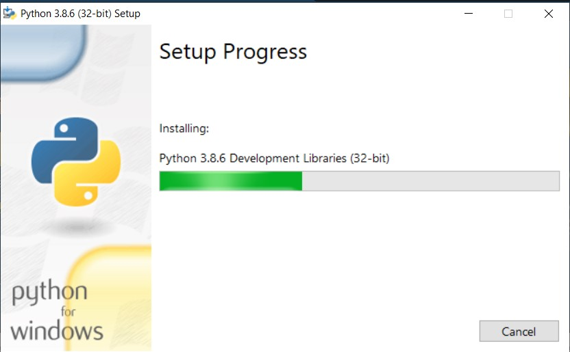

## Install Python

Berikut ini langkah-langkah menginstall bahasa pemrograman python di windows.

#### 1. Download 

Pastikan kita telah mendownload software installer program python ini supaya kita bisa menggunakan.

#### 2. Install

Kemudian jika sudah download installer langsung saja buka installer tersebut.

#### 3. Proses

Tunggu proses installer sampai selesai

#### 4. Selesai

Yap, Prose install python sudah selesai dan program bisa digunakan.