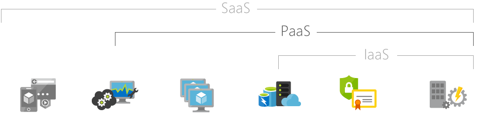

## Rangkuman Platform as a Service

Platform sebagai layanan ( PaaS ) atau layanan berbasis platform adalah kategori layanan komputasi awan yang menyediakan platform yang memungkinkan pelanggan untuk mengembangkan, menjalankan, dan mengelola aplikasi tanpa kerumitan dalam membangun dan memelihara infrastruktur yang biasanya terkait dengan pengembangan dan peluncuran aplikasi.

### Contoh Penggunaan PaaS

Ada banyak contoh penggunaan untuk PaaS, termasuk yang berbasis aplikasi populer berikut ini:

#### a.	Pengembangan dan pengelolaan API: 

Anda dapat menggunakan PaaS untuk mengembangkan, menjalankan, mengelola, dan mengamankan antarmuka pemrograman aplikasi (API) dan layanan mikro.

#### b.	Internet of Things (IoT): 

PaaS dapat mendukung berbagai lingkungan aplikasi, bahasa pemrograman, dan alat yang digunakan untuk penerapan IoT.

#### c.	Analisis / kecerdasan bisnis: 

Alat PaaS memungkinkan Anda menganalisis data untuk menemukan wawasan bisnis yang memungkinkan keputusan dan prediksi bisnis yang lebih tepat

### Keuntungan dari PaaS

Berikut ini beberapa keuntungan menggunakan PaaS:

#### a.	Mengurangi Waktu Konfigurasi. 

Alat pengembangan PaaS dapat mengurangi waktu yang diperlukan untuk membuat kode aplikasi baru yang dibangun ke dalam platform, seperti alur kerja, layanan direktori, fitur keamanan, pencarian, dan sebagainya.

#### b.	Tidak memerlukan penambahan staff jika ingin menambah development.

Komponen Platform as a Service dapat memberi tim pengembangan Anda kemampuan baru tanpa perlu menambahkan staf yang memiliki keterampilan yang diperlukan.

#### c.	Multiplatform Konfigurasi

Memberikan kemudahan pengembangan untuk berbagai platform, seperti komputer, perangkat seluler, dan browser.

#### d.	Tools modern dengan harga terjangkau.

Model pay-as-you-go memungkinkan individu atau organisasi untuk menggunakan perangkat lunak pengembangan dan kecerdasan bisnis serta alat analitik yang canggih dengan harga yang terjangkau.

### Kekurangan dari PaaS

Berikut in beberapa poin kekurangan menggunakan PaaS:

#### a.	Peningkatan harga pada skala yang lebih besar

Model pay-as-you-go terkadang dapat membengkak jika tidak cerdas dalam mengelola sumber daya dari layanan penyedia PaaS.

#### b.	Kurangnya fitur operasional

Karena seluruh peralatan dan kebutuhan operasional sudah disediakan oleh penyedia PaaS jadi kita tidak bisa melakukan penambahan dari segi fisik ataupun memodifikasi.

#### c.	Kontrol yang berkurang

Selalu ada level untuk melakukan konfigurasi baik itu level super user ataupun user biasa tergantung kebijakan penyedia layanan PaaS.

**Sumber**
- https://en.wikipedia.org/wiki/Platform_as_a_service

- https://www.ibm.com/cloud/learn/paas

- https://azure.microsoft.com/en-us/overview/what-is-paas/
