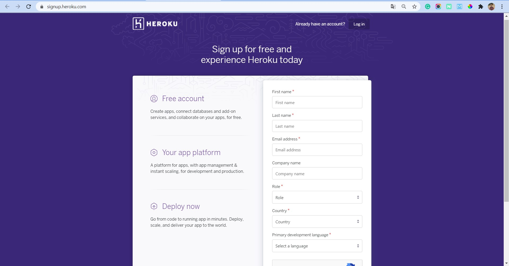
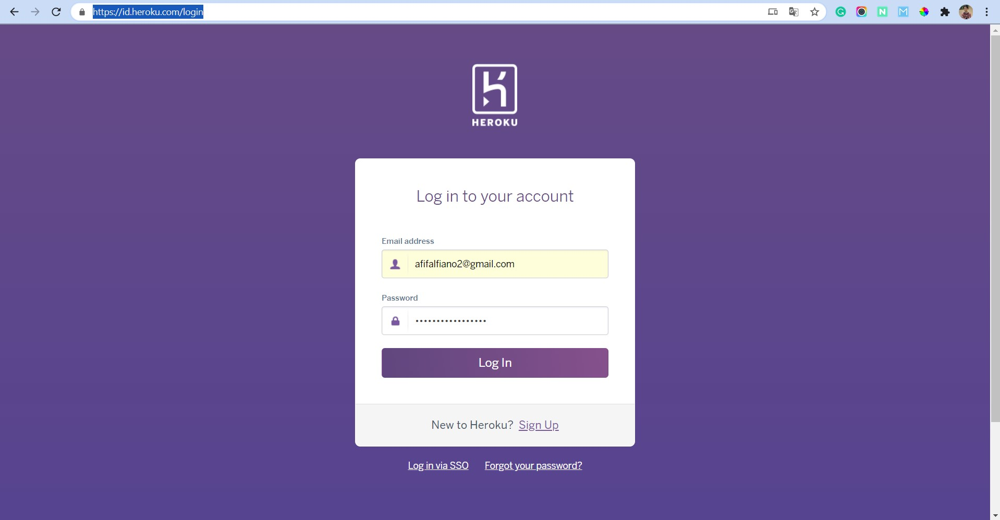
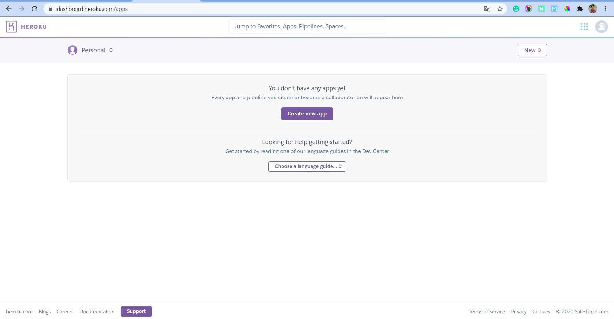

## Sign Up / Sign In Heroku

Untuk menggunakan layaan PaaS dari Heroku ini kita harus mempunyai akun terlebih dahulu. Jika belum punya bisa lakukan sign up terlebih dahulu, jika sudah punya tinggal login saja.

#### Sign Up

Untuk sign up bisa kunjungi situs berikut ini signup.heroku.com kemudian tinggal lengkapi isian yang ada.

#### Sign In

Jika sudah mempunyai akun atau proses sign up sudah berhasil bisa langsung sign in saja. Langsung saja kunjungi id.heroku.com/login untuk melakukan proses login. Pastikan email dan password sudah sesuai dan klik log in.

Nah seperti ini tampilan awal dashboard heroku

