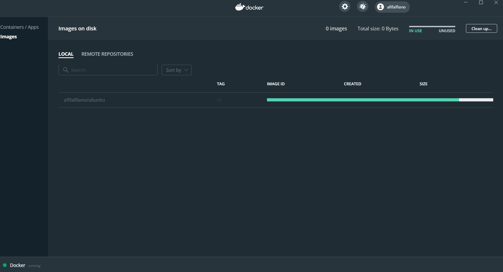
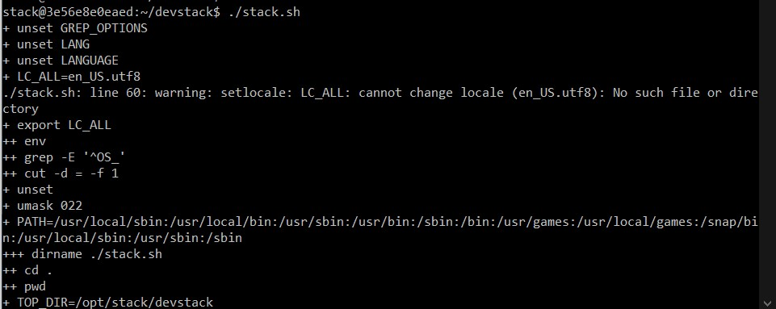

## Install Devstack

Untuk menginstall devstack ini saya menggunakan virtualisasi container menggunakan docker

#### 1. Download Docker Hub

Untuk menggunakan docker ini pastikan memiliki akun dan download docker hub di situs resminya di hub.docker.com

#### 2. Install

Kemudian buka installer tersebut dan jalankan sampai proses install selesai.

Setelah selesai jangan lupa untuk merestart.

#### 3. Jalankan Docker

Setelah selesai langsung saja jalankan docker.

Nah, disini saya sudah memilki container untuk operating system ubuntu jadi saya tinggal masuk ke tab remote repositories dan saya pull container ubuntu supaya dapat dijalankan dilocal.

Tunggu proses pull sampai selesai & tinggal jalankan dengan klik Run.

#### 4. Tambahkan User Stack

Setelah berhasil menjalankan ubuntu langsung saja buat user baru untuk stack

Kemudian jalankan perintah sudo su - stack untuk berpindah akses ke user stack.

Jika masih error maka bisa kita cek pada file /etc/sudoers yang mana bisa kita tambahkan secara manual ada User privilege specification

#### 5. Install Git

Selanjutnya install git dengan cara menjalankan sudo apt -y install git

Setelah itu clone project yang sudah ada digithub.

#### 6. Konfigurasi Devstack

Kemudian tambahkan file localhost.conf dan isi konfigurasinya seperti dibawah ini.

Kemudian untuk menjalankan project devstack tinggal masuk ke repository devstack dan jalankan perintah ./stack.sh

Tunggu sampai proses selesai

Tapi disini saya ada beberapa kendala seperti dibawah ini. Pada akhirnya jika berhasil nanti tinggal akses saja ip yang terdapat pada file localhost.conf

Sebelum melakukan install devstack saya juga menambahkan beberapa libary seperti python3, python3-dsutils, ip command dan iptables. Tapi masih saja terdapat kendala.