## Install Mininet

Untuk menginstall mininet ini saya menggunakan virtualisasi container menggunakan docker

#### 1. Download Docker Hub

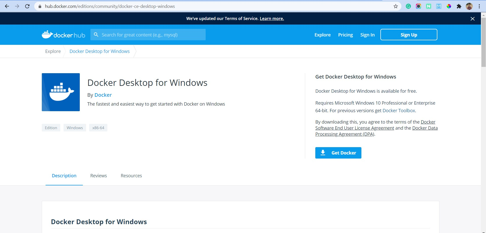

Untuk menggunakan docker ini pastikan memiliki akun dan download docker hub di situs resminya di hub.docker.com

#### 2. Install

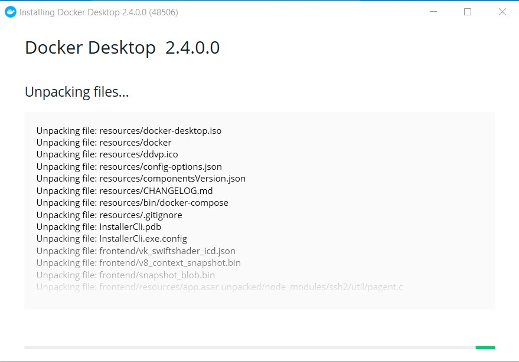

Kemudian buka installer tersebut dan jalankan sampai proses install selesai.

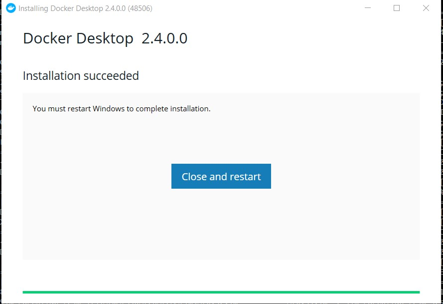

Setelah selesai jangan lupa untuk merestart.

#### 3. Jalankan Docker

Setelah selesai langsung saja jalankan docker.

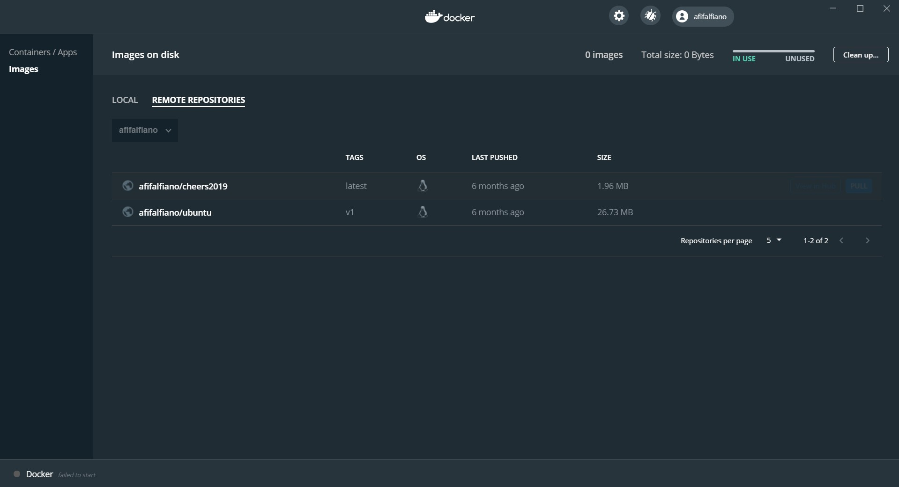

Nah, disini saya sudah memilki container untuk operating system ubuntu jadi saya tinggal masuk ke tab remote repositories dan saya pull container ubuntu supaya dapat dijalankan dilocal.

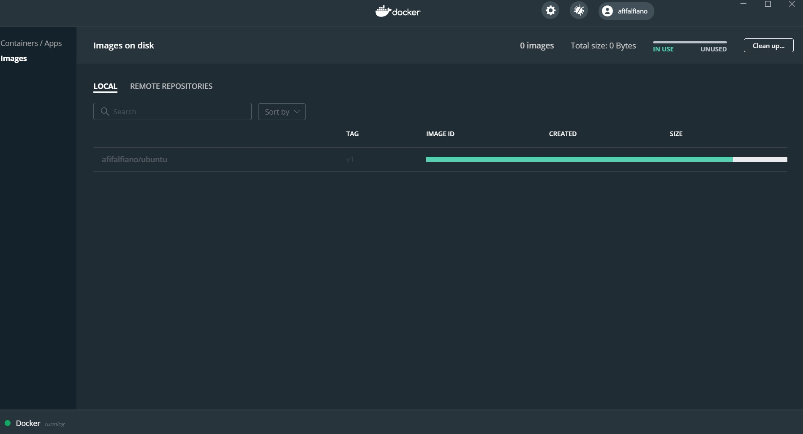

Tunggu proses pull sampai selesai & tinggal jalankan dengan klik Run.

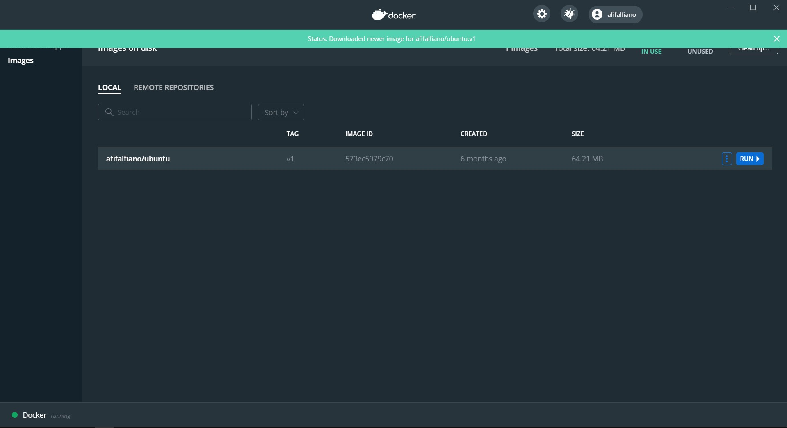

#### 4. Install Wireshark

Setelah berhasil masuk ke terminal ubuntu langsung saja install wireshark untuk keperluan mininet.

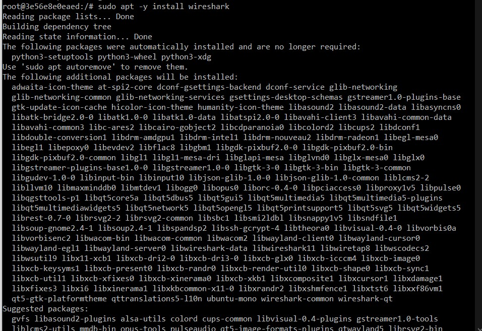

#### 5. Clone Mininet atau Install Mininet

Selanjutna install mininet melalui repo yang disediakan ubuntu atau bisa juga dengan clone project yang ada di github.

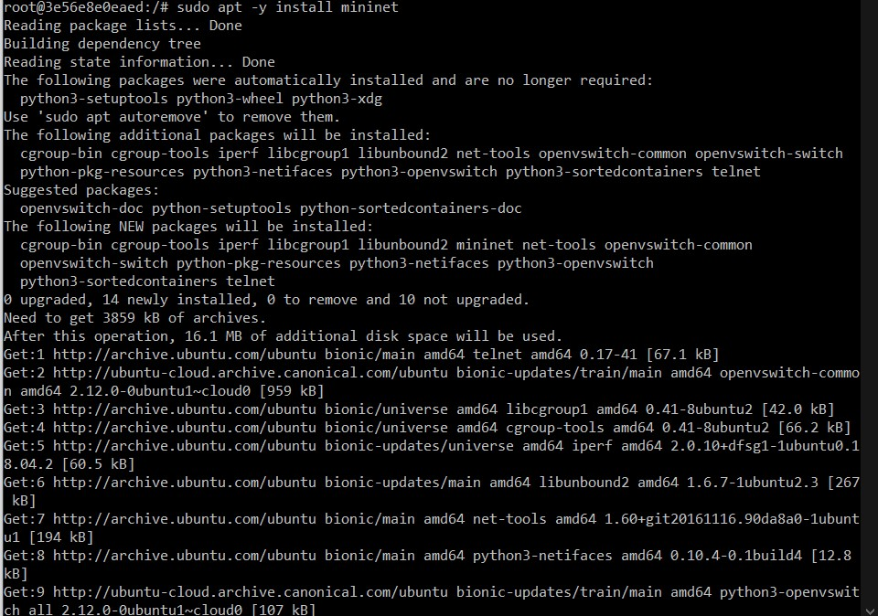

Nah, seperti ini tampilan jika kita melakukan clone project mininet dari github.

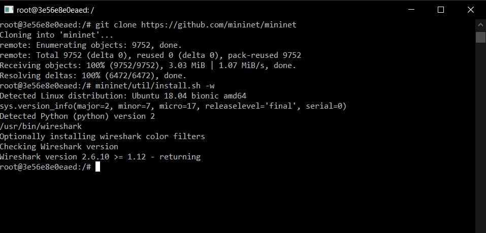

#### 6. Jalankan Wireshark & Mininet

Setelah semua library yang dibutuhkan sudah terinstall langsung saja kita coba untuk menjalankan wireshark dan mininet.

Untuk menjalankan wrapper wireshark tinggal jalankan perintah sudo wireshark &

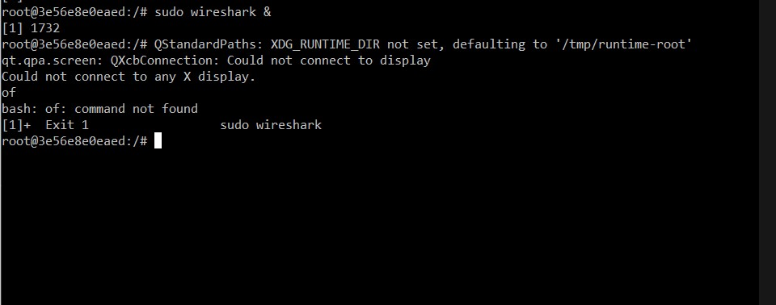

Kemudian jalankan mininet dengan perintah sudo mn

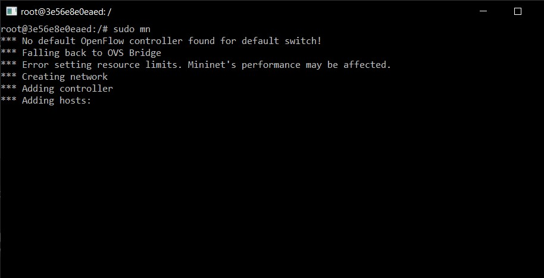

Nah selanjutnya tinggal konfigurasi menyesuaikan kebutuhan yang ada.

