## Install Apache OFBiz

Untuk menginstall apache ofbiz kita memerlukan beberapa library yang harus diinstall

#### 1. Install OpenJDL Binaries

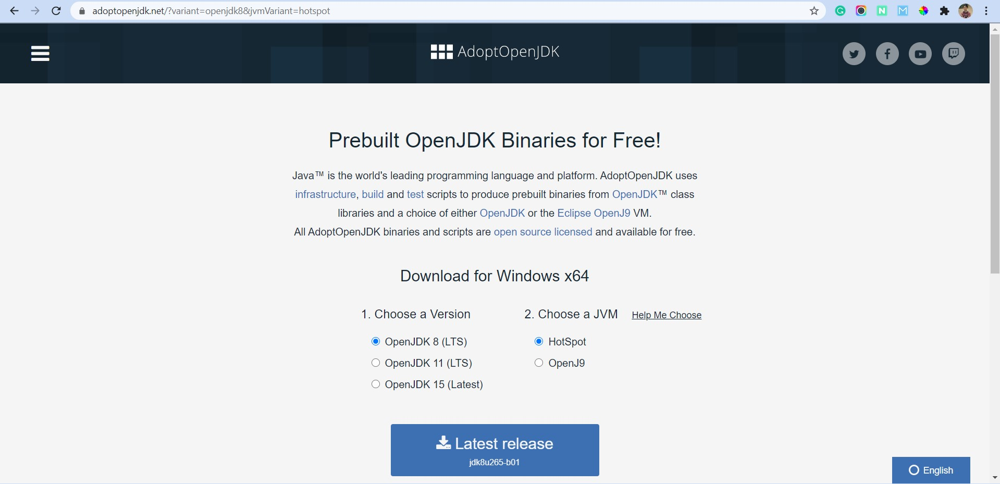

Untuk mendownload file tersebut langsung saja kunjungi situs resminya dan lakukan install setelah file sudah terdownload.

#### 2. Install Apache OFBiz

Kemudian untuk menginstall apache ofbiz kita perlu mendownload file installer disitus resimnya.

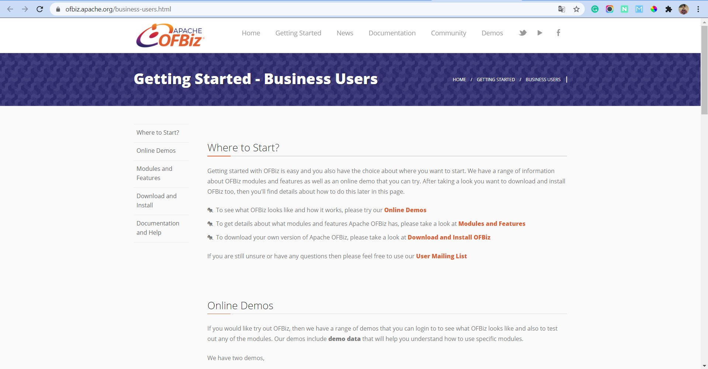

Kemudian pilih menu Download and Install

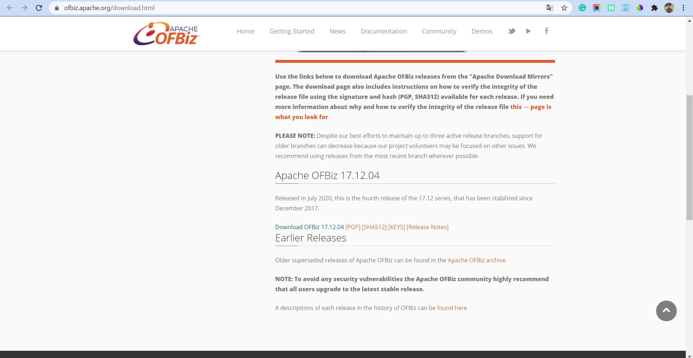

Bentuk filenya adalah sebuah zip, jadi kita perlu mengekstract dan menjalankan installer tersebut.

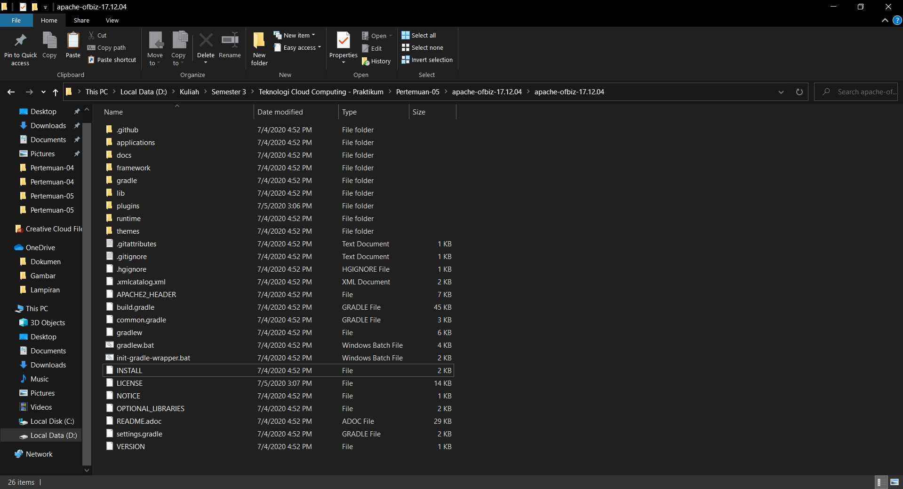

Kemudian ikuti panduan yang ada pada file INSTALL

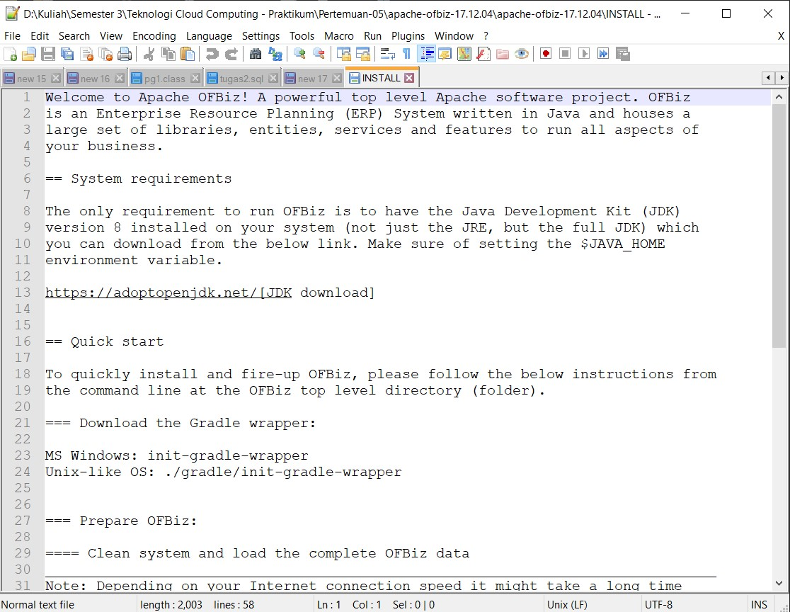

##### A. Install Gradle

Langkah pertama pastikan kita sudah memiliki software gradle. Jika belum bisa langsung download file installernya di situs resimnya gradle. Bentuk filenya pun juga zip jadi kita perlu mengekstrak.

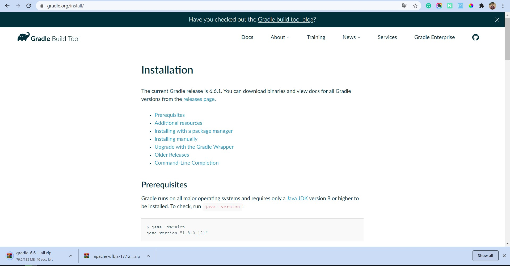

Setelah sudah terektrak kita perlu menambahkan path command gradle di environment windows.

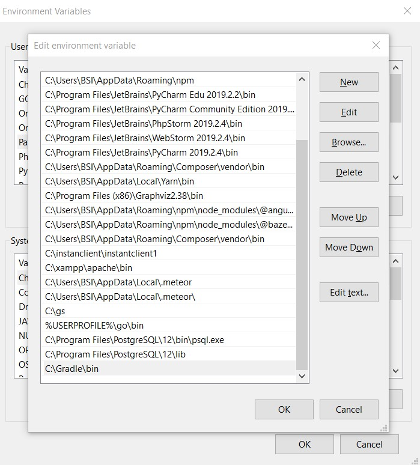

Setelah itu kita cek versi dari gradle yang kita pakai dengan menjalankan perintah gradle -v

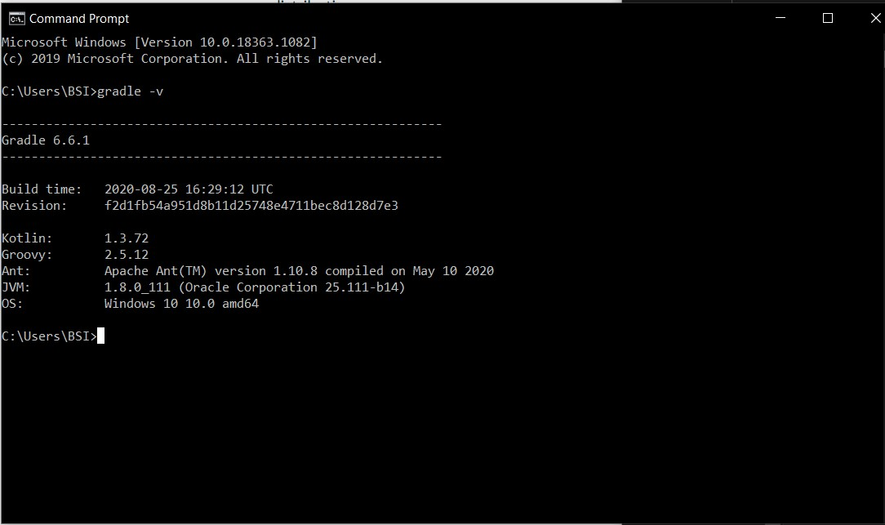

#### 4. Eksekusi Installer

Setelah semua persiapan sudah selesai maka tinggal kita jalankan installer gradle. Pastikan kita sudah berada difolder dimana hasil ekstrak aplikasi apache ofbiz.

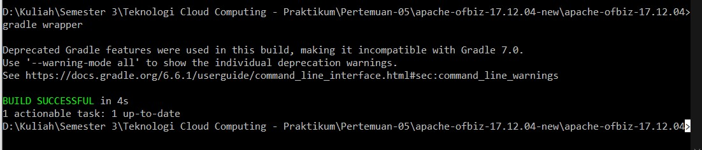

Jalankan perintah gradle wrapper untuk memjalankan aplikasi apache ofbiz.

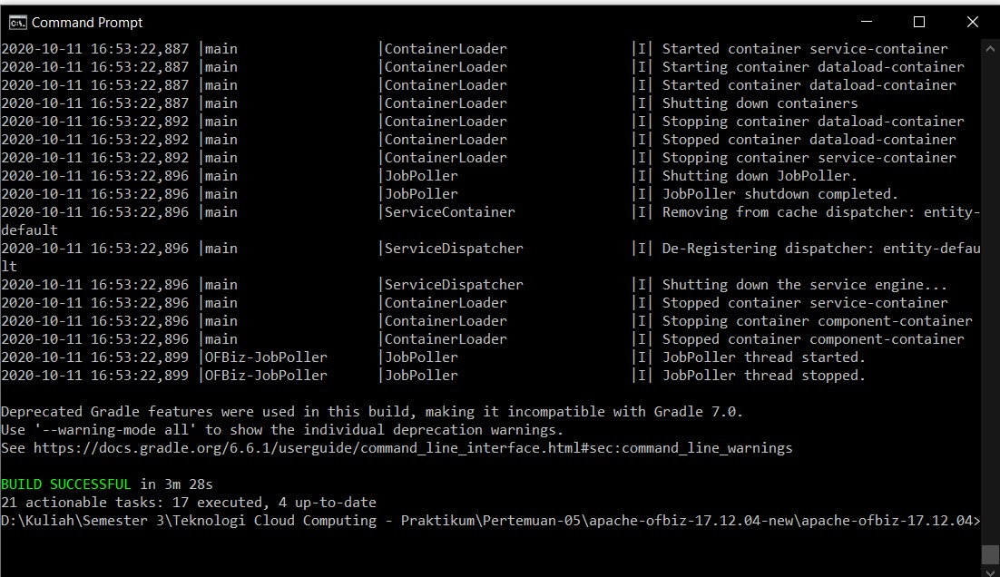

Tunggu proses gradle wrapper sampai selesai.

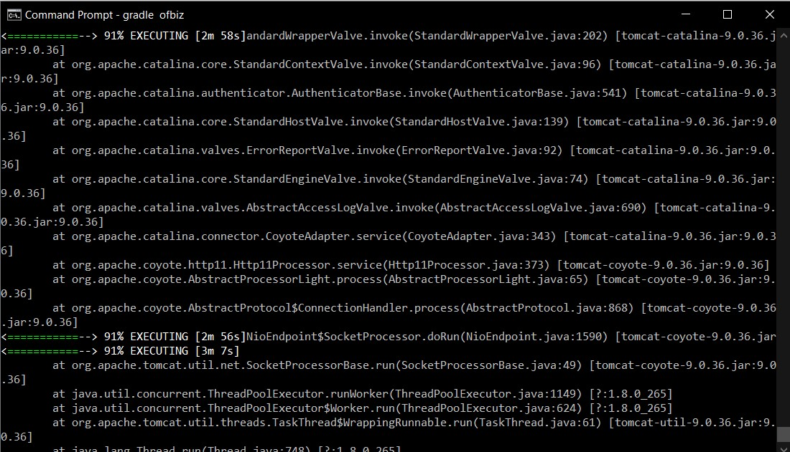

Kemudian jalankan perintah gradle/gradlew cleanAll loadAll

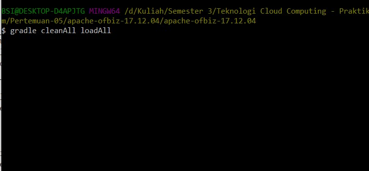

Tunggu proses sampai selesai

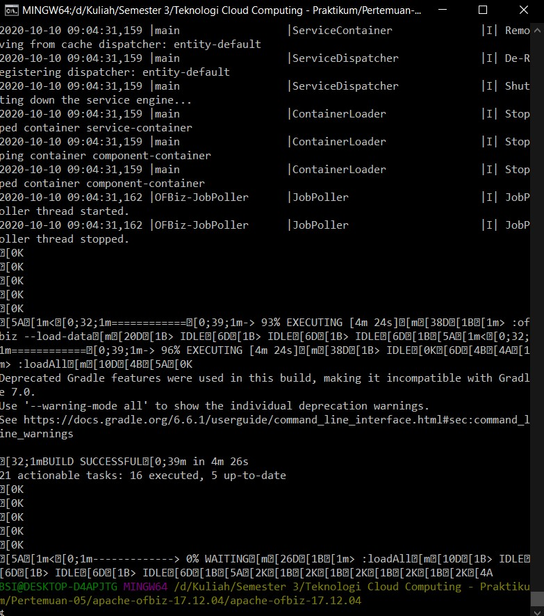

Setelah proses build selesai langsung saja jalankan perintah gradle/gradlew ofbiz

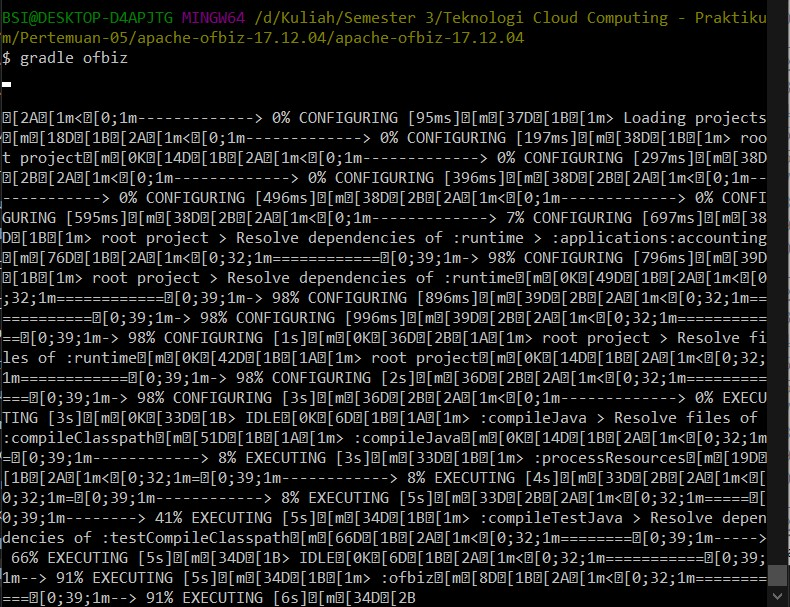

Maka ketika menjalankan aplikasi tersebut memerlukn allow access ke administrator.

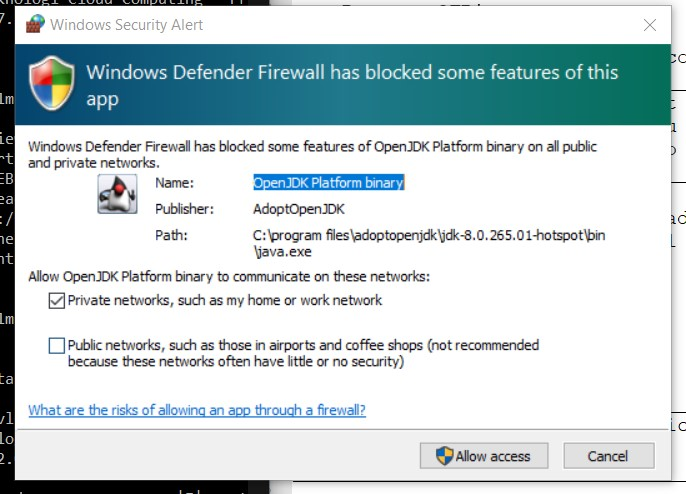

Proses gradle apache ofbiz memakan banyak waktu, tapi tidak perlu menunggu sampai selesai.

Langsung saja akses halaman dashboard aplikasi tersebut dengan url http://localhost:8443/webtools

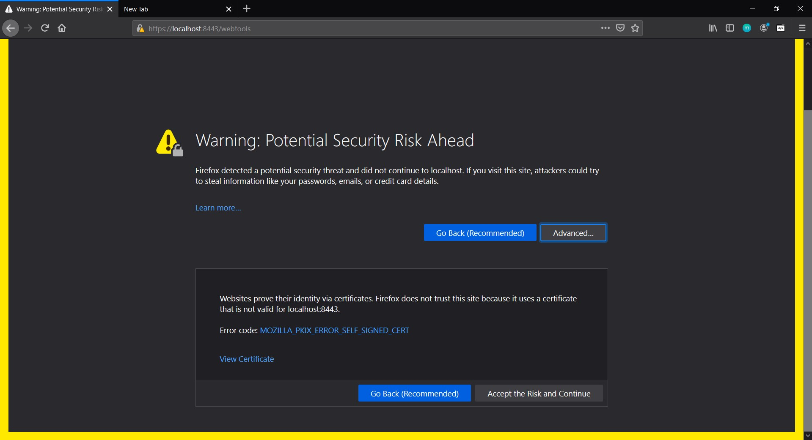

Berikut ini tampilan awal dari aplikasi apache ofbiz.

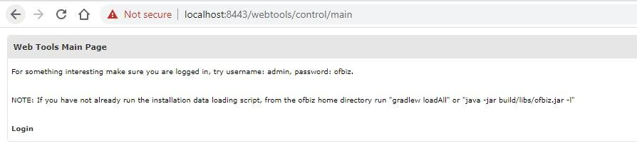

Setelah itu terdapat halaman login untuk aplikasi apache ofbiz. Gunakan saja default untuk login username: admin, password: ofbiz.

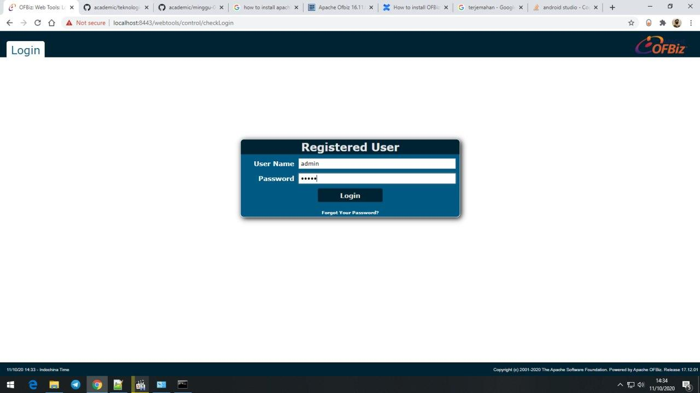

Nah, seperti ini tampilan awal apache ofbiz.

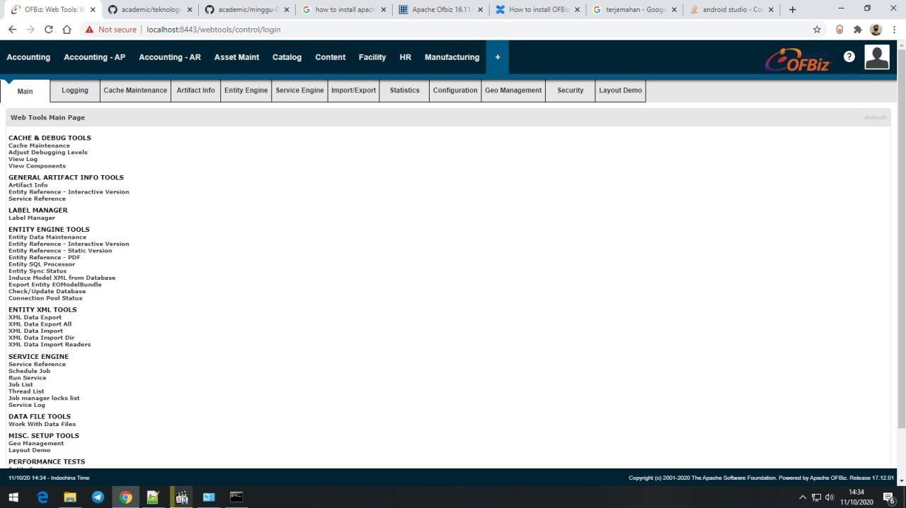

