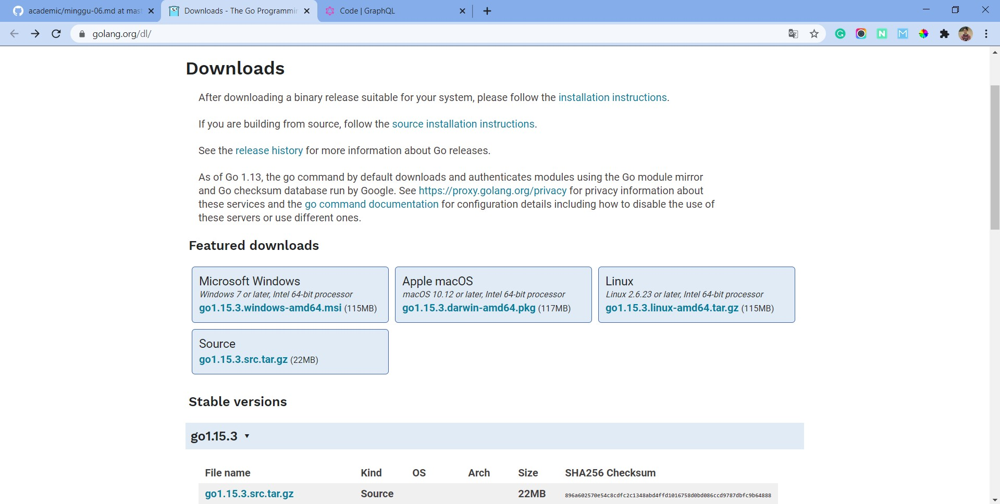
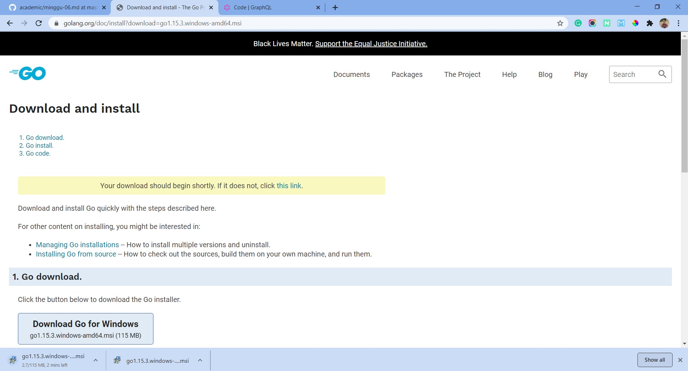
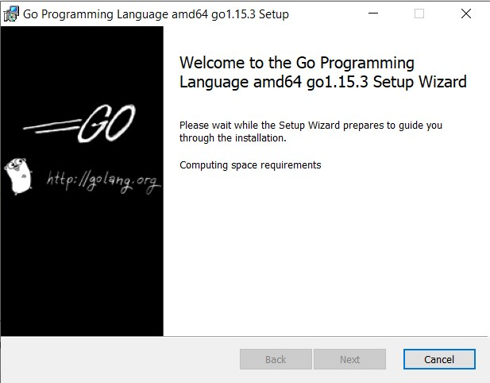
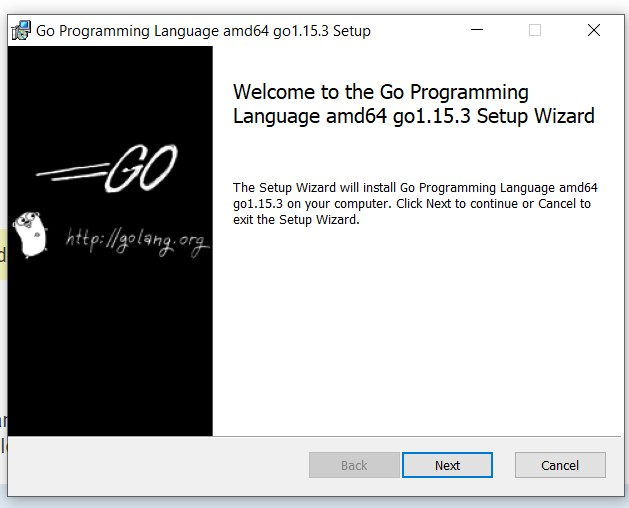
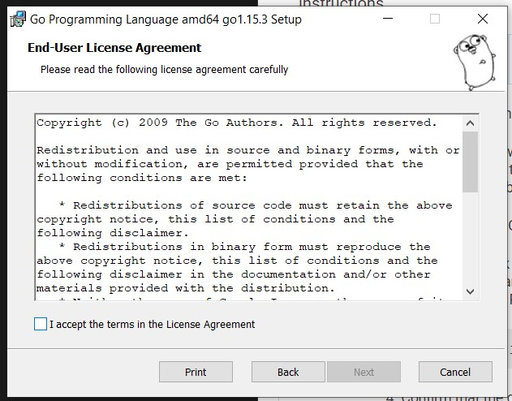
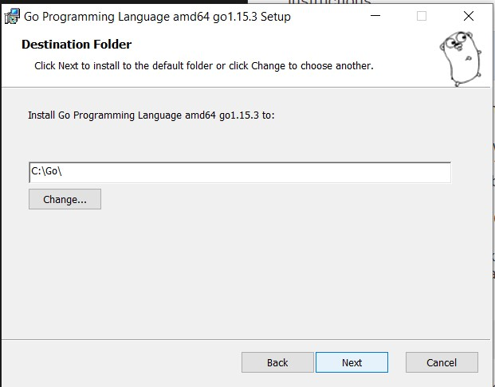
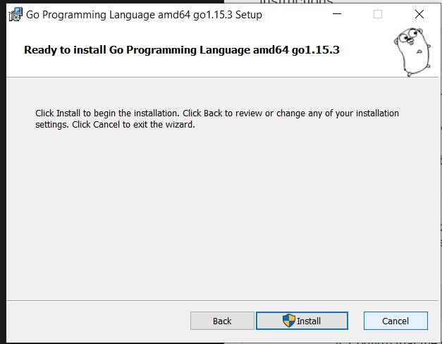
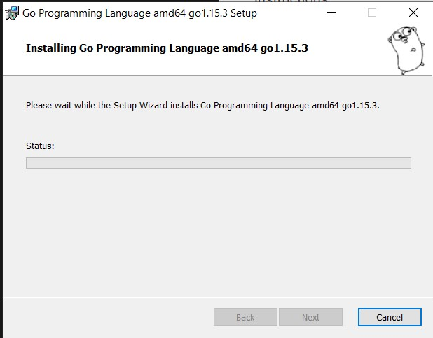
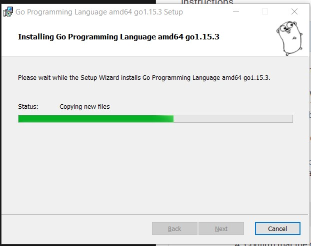
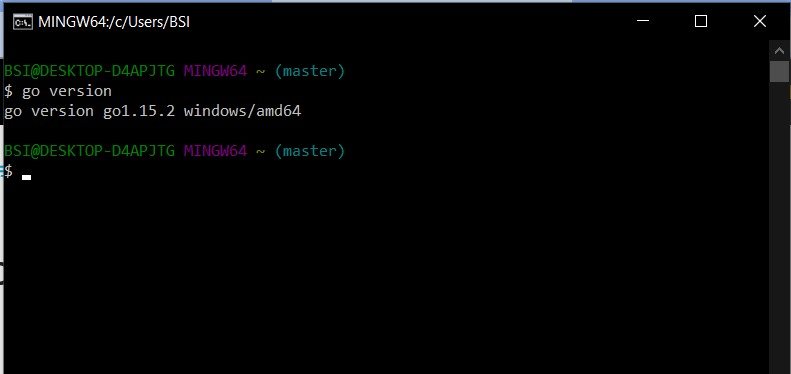

## Install Go

Berikut ini cara menginstall bahasa pemrogramana golang di windows

#### 1. Download Installer

Download terlebih dahulu installer untuk golang ini disitus resimnya yaitu golang.org/dl.

Kemudian tunggu proses download samapai selesai.

#### 2. Jalankan Installer

Setelah program selesai terdownload jalankan installer golang tersebut.

Kemudian klik next saja

Setelah itu check untuk persetujuan end user dan klik next lagi

Kemudian setting dimana program tersebut berada. Biasaya berada di C.

Setelah selesai konfigurasinya tinggal klik install.

Tunggu proses installer sampai selesai.

. 

#### 3. Check Version

Setelah terinstall tinggal cek versi dengan cara menjalankan perintah go version

Selamat! Golang sudah bisa digunakan.

[Kembali](README.md)

