## Install MongoDB

Berikut ini cara menginstall database mongodb di windows

#### 1. Download Installer

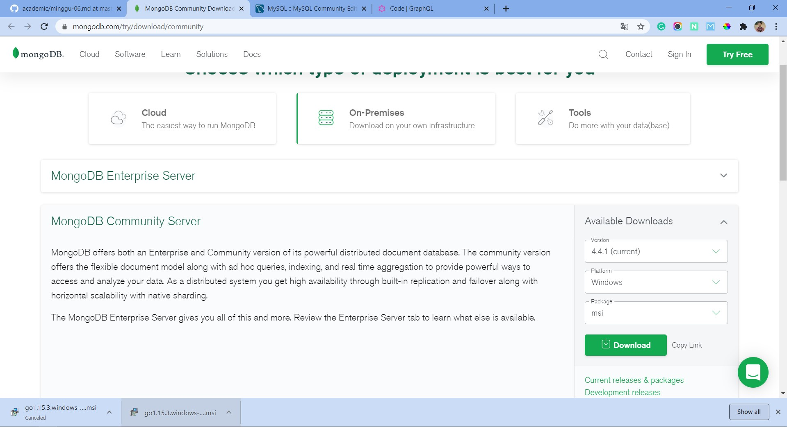

Download terlebih dahulu installer mongodb untuk windows di situs resimnya.

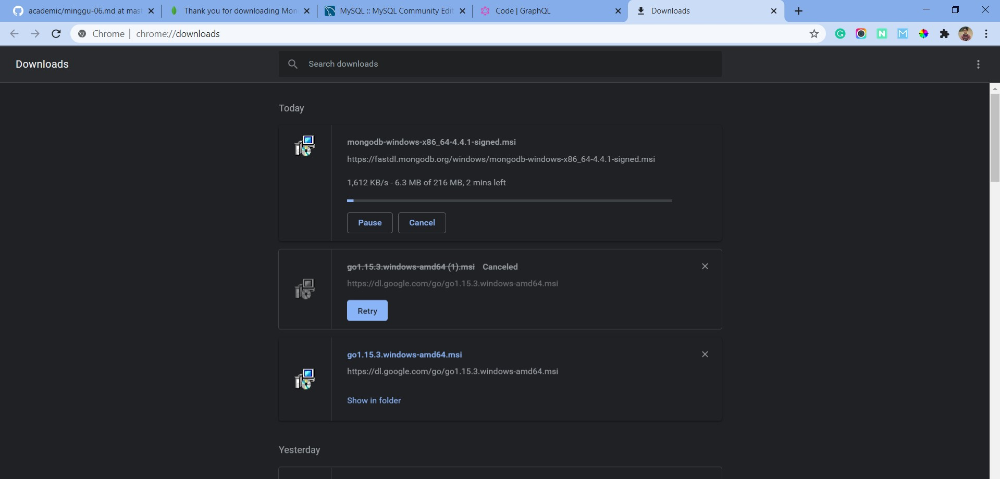

Kemudian tunggu proses download samapai selesai.

#### 2. Jalankan Installer

Setelah program selesai terdownload jalankan installer mongodb tersebut.

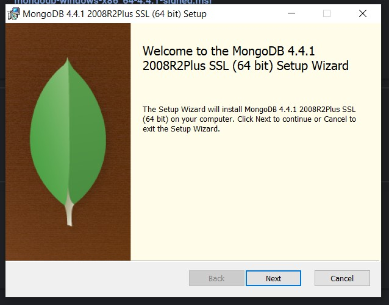

Kemudian check untuk persetujuan end user dan klik next lagi

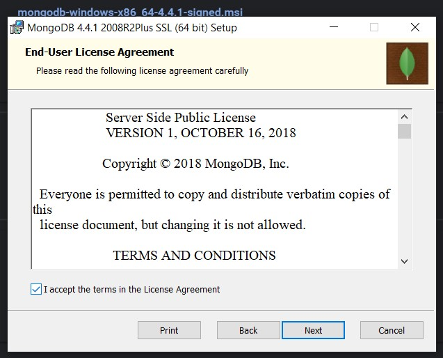

Kemudian pilih versi installernya complete saja dan klik next.

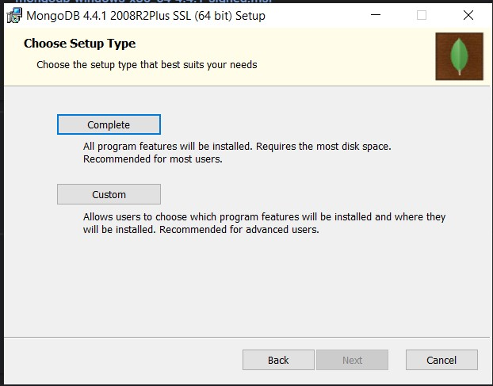

Kemudian pada service configuration biarkan default saja dan klix next kembali.

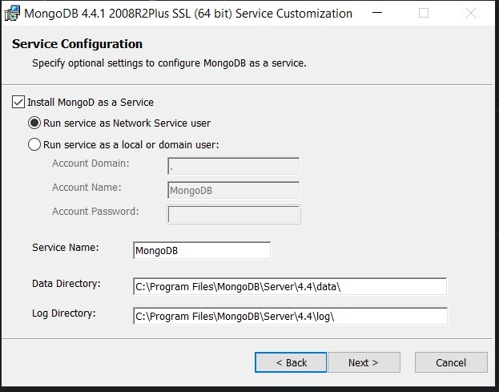

Setelah itu check juga untuk menginstall mongodb compass. Fungsinya untuk mempermudah manage database mongodb karena mongodb bermodel noSQL.

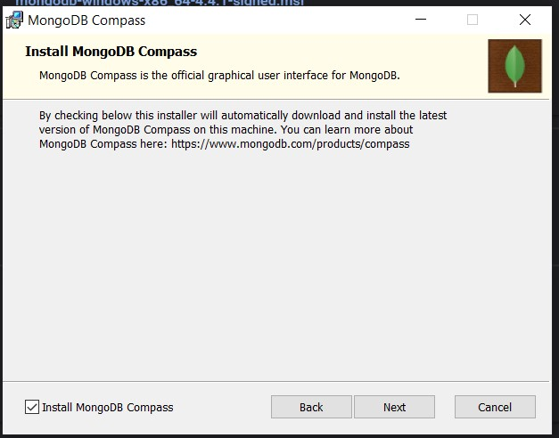

Setelah selesai konfigurasinya tinggal klik install.

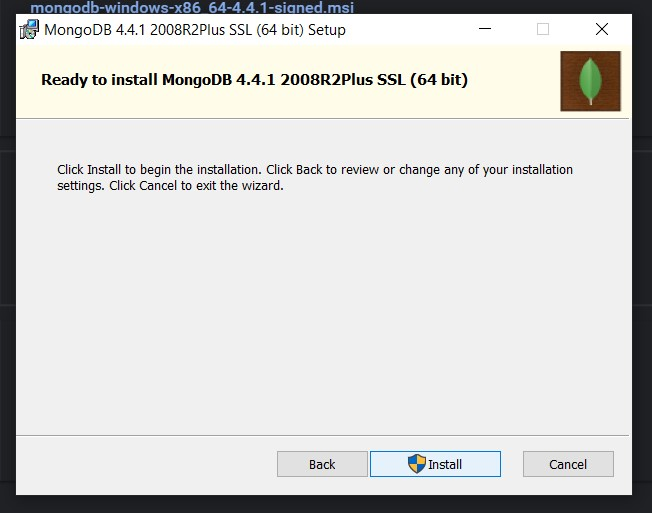

Terdapat konfirmasi jika proses installer selesai maka akan reboot atau restart sendiri. Pilih OK saja.

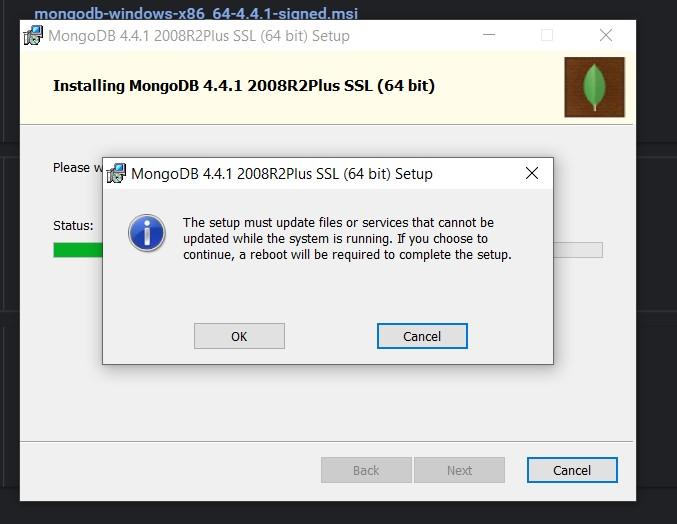

Tunggu proses install sampai selesai.

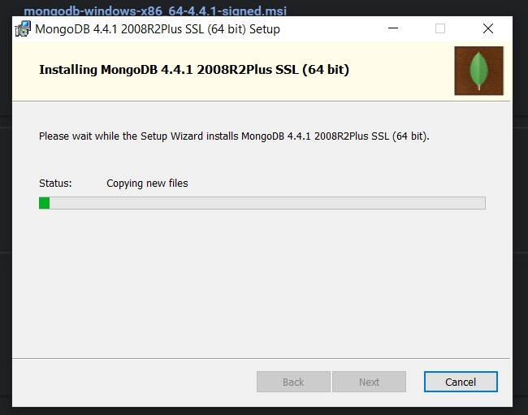

.

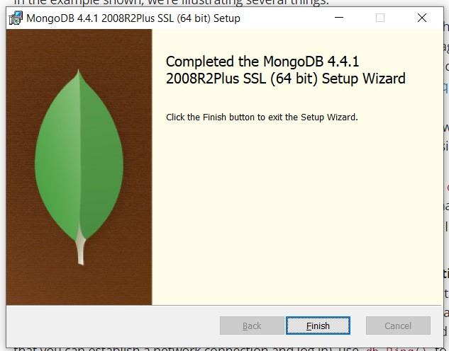

#### 3. Jalankan MongoDB Compass

Setelah proses intall selesai dan proses reboot telah selesai langsung saja jalankan program compass mongodb.

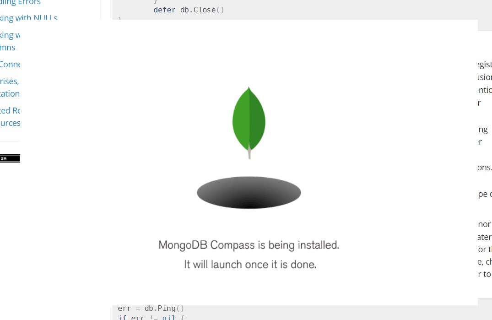

Tunggu initialize program mongodb compas seelsai.

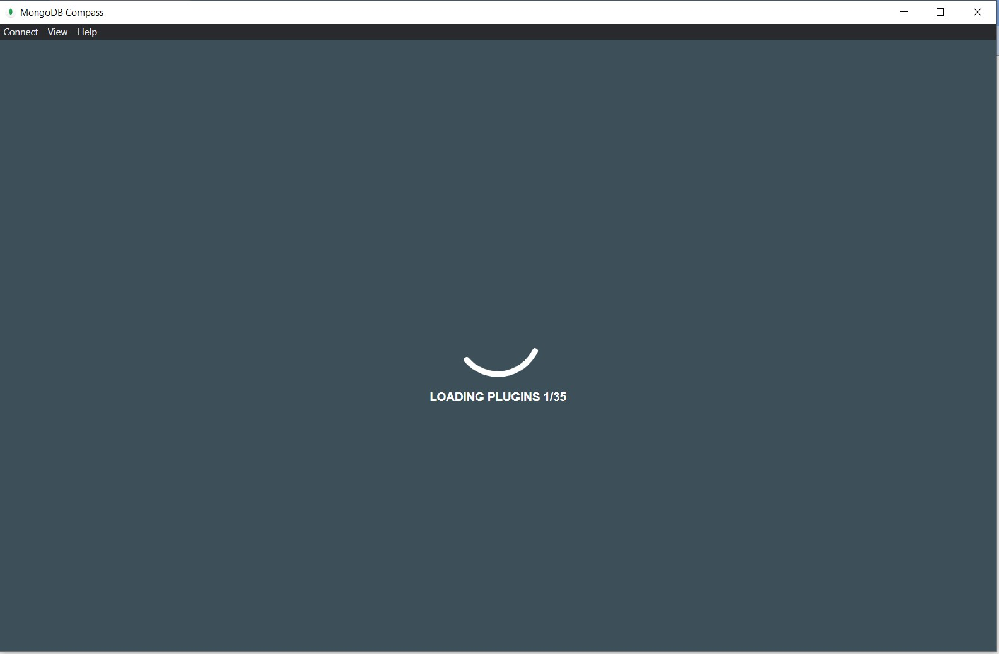

Nah langsung saja klik start using compass

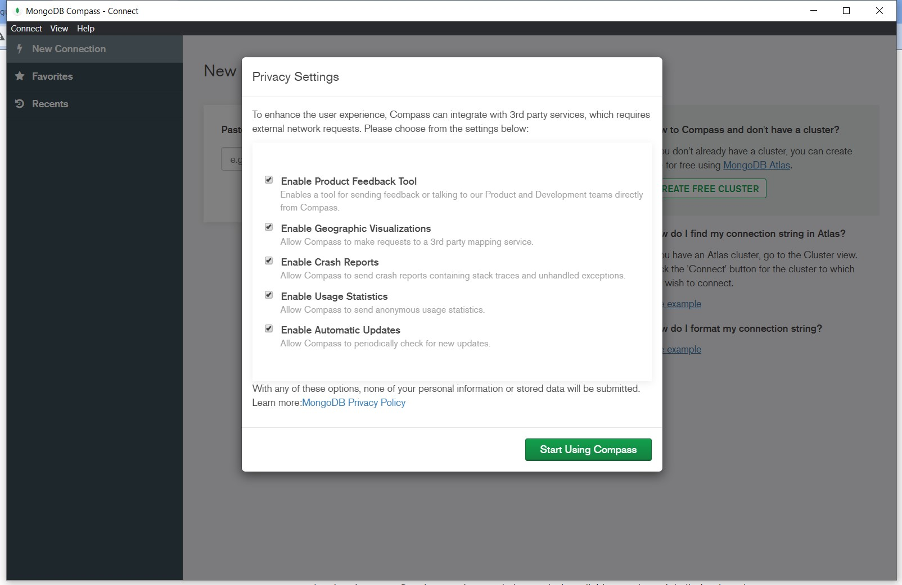

Selamat! MongoDB Compass sudah bisa digunakan.

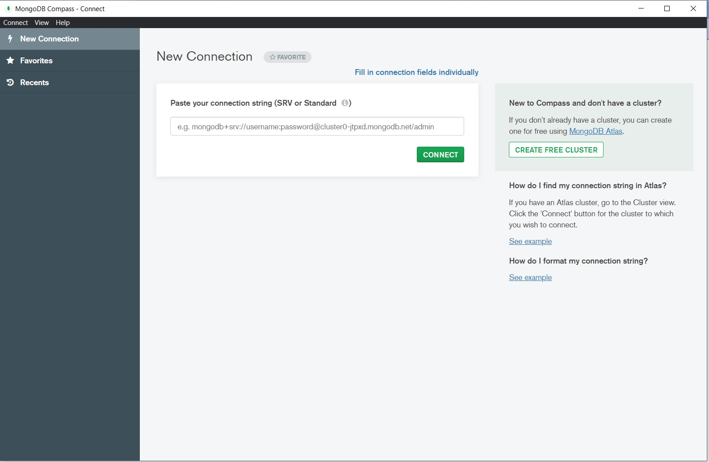

Untuk menggunakan secara localhost pilih saja opsi fill in conection fields individually

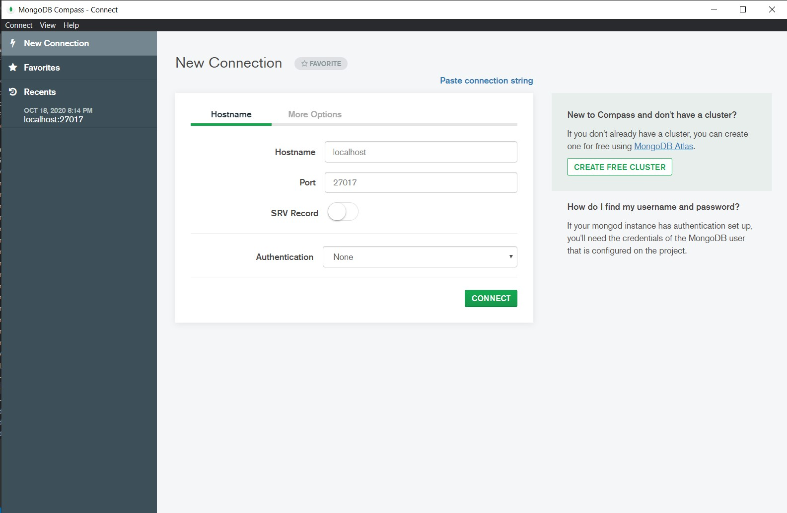

Kemudian langsung saja klik connect.

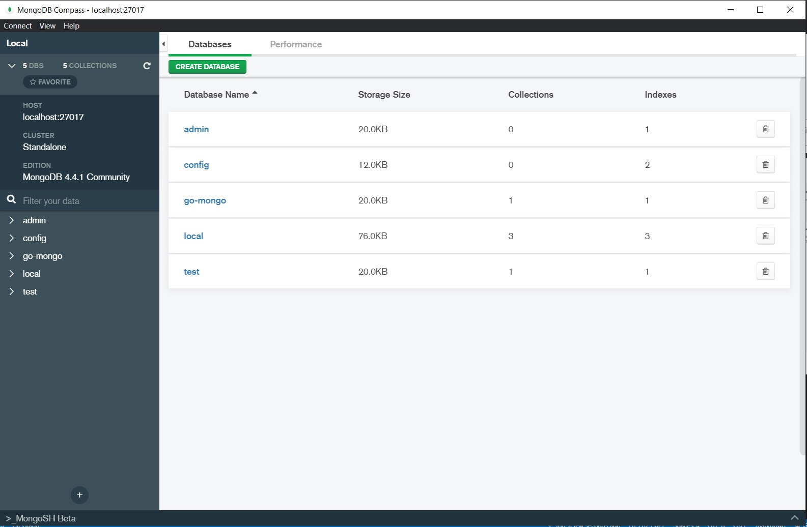

Nah gambar diatas merupakah hasil manage database mongodb yang ada di local saya. Masing-masing database memilki collectionnya sendiri karena sifatnya database ini noSQL.

[Kembali](README.md)