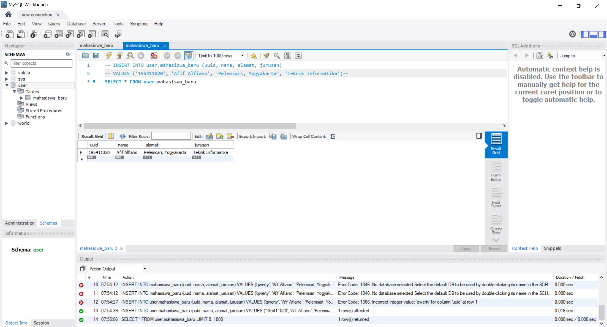

## Read Data MySQL with GO

Untuk Membaca data dari database mysql menggunakan golang kita perlu membuat database/schema baru.

#### 1. Jalankan MySQL Workbench

Login terlebih dahulu ke local database dengan root dan password yang sudah kita buat waktu proses install tadi.

Nah seperti ini tampilan awal dari mysql workbench

#### 2. Buat Database & Tabel Baru

Buat schema atau database baru menggunakan mysql workbench.

Kemudian klik apply saja dan tunggu proses sampai selsai.

Janganl lupa untuk menambahkan tabelnya juga.

Tambahkan table seperti berkut ini.

#### 3. Query Database

Kemudian tambahkan data dummy bisa menggunakan query atau langsung mengisikan pada tabel yang ada.

Tambahkan beberapa data baru

#### 4. Buat Program GO

Untuk menginisialisasi project awal go jalankan perintah go mod init namaproject

Kemudian buat program seperti berikut ini

Penjelasan:
Menggunaka library database/sql, log dan go-sql-driver/mysql. Pada program go pasti akan selalu memiliki func main() dimana program akan menjalankan fungsi tersebut. Pada baris 11 kita melakukan koneksi ke database dengan ketentuan namauser:password@tcp(alamat:port)/namadatabase. Jika koneksi gagal maka akan menjalankan kode pada baris ke 16.

Kemudian terdapat type untuk user berupa uuid, nama, alamat dan jurusan. Selanjutnya pada baris 24 kita query ke database mysql. Untuk membaca data selanjutnya tinggal jalanakan fungsi for rows.Next() dan didalam for tersebut jangan lupa untuk menggunakan fungsi rows.Scan() data yang ingin kita ambil.

Jika berhasil maka outputnya akan menjalankan kode pada baris ke 34 dan jika gagal maka akan menjalankan kode pada baris ke 38.

Kemudian untuk menjalankan program go tinggal jalankan perintah go run main.go maka secara otomatis program jalan dan akan mendapatkan data dari database mysql.

[Kembali](README.md)