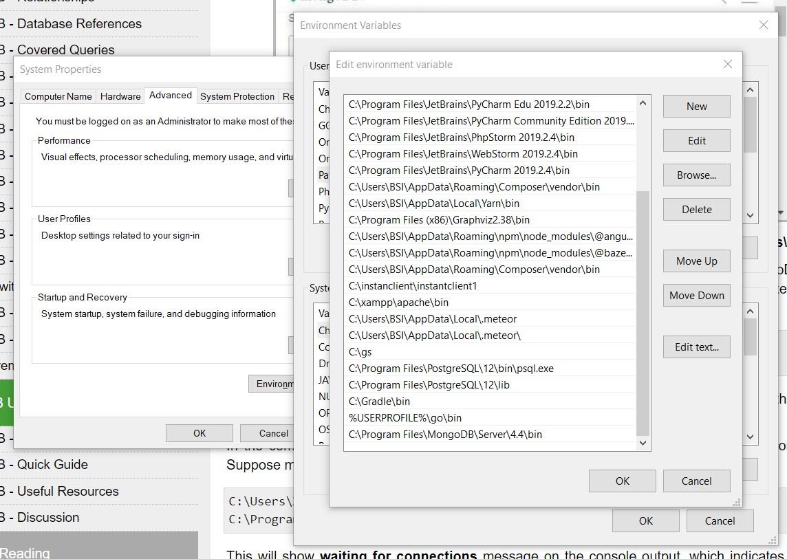
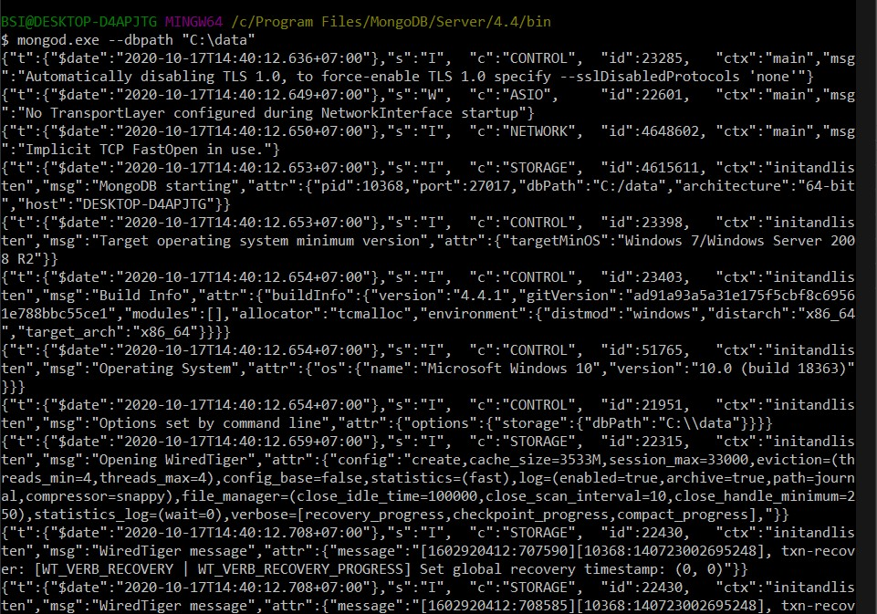
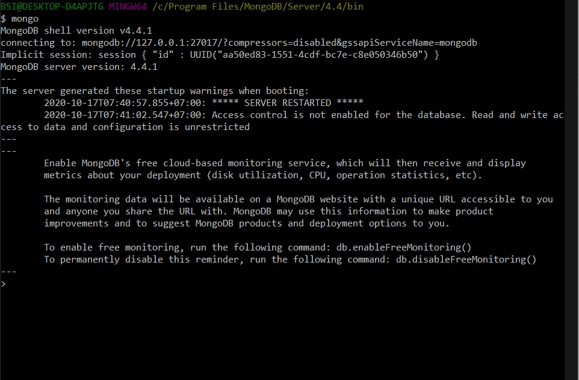
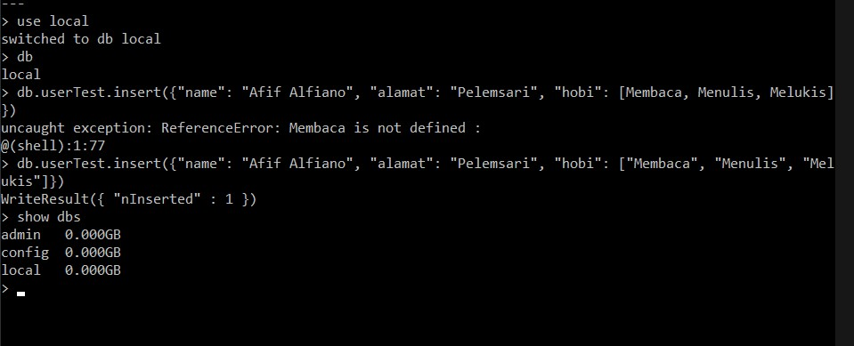
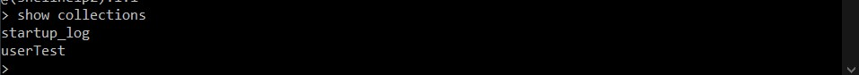
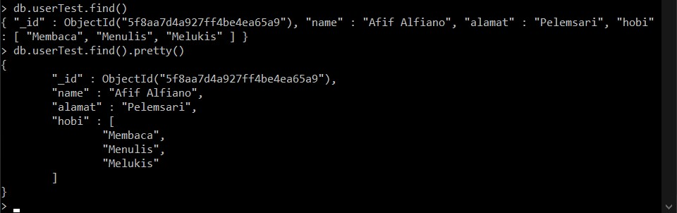
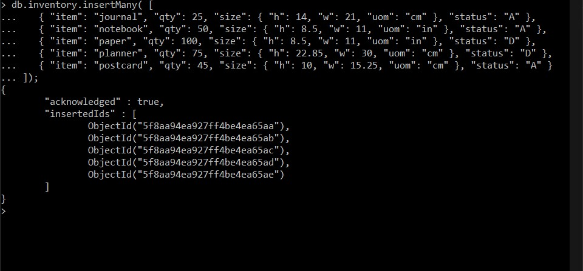
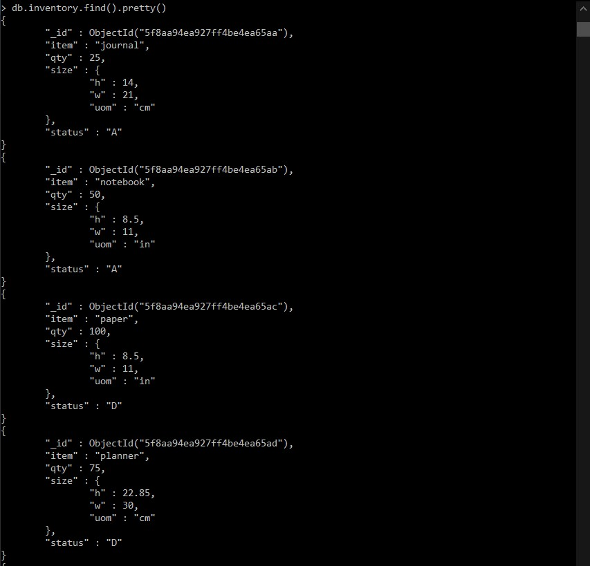
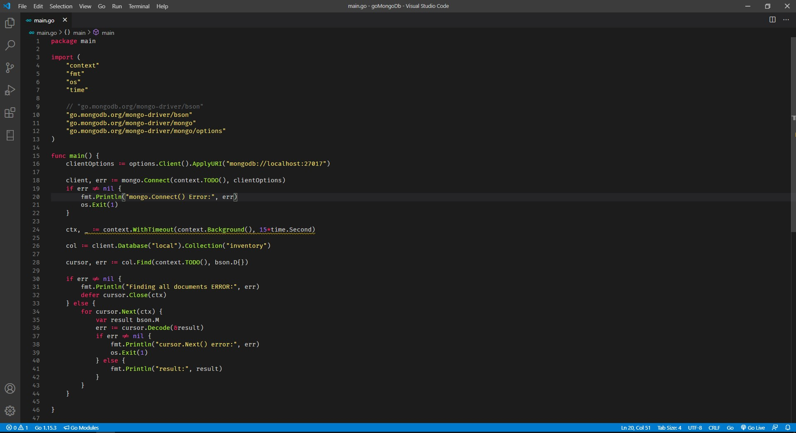
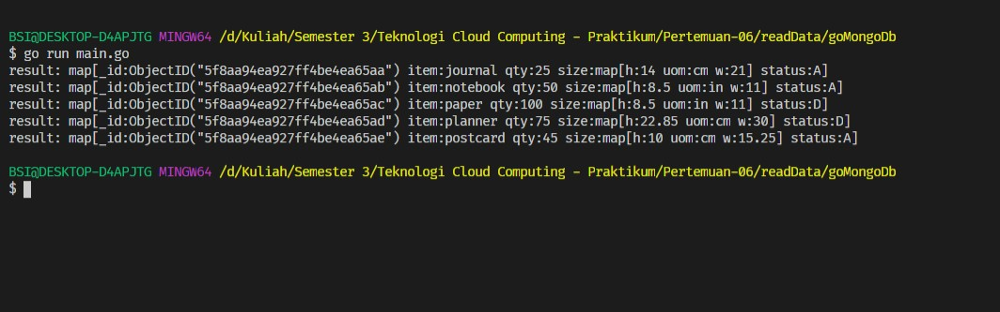

## Read Data MongoDB with GO

Untuk Membaca data dari database MongoDB menggunakan golang kita perlu membuat collection baru dan cukup menggunakan database local saja.

#### 1. Jalankan MongoDB Compass

Langsung saja pilih opsi Fill in conection fields individually untuk menjalankan secara local.

Kemudian set terlebih dahulu environment untuk mongo.exe

Kemudian set juga penyimpanan dbpath yang defaultnya ada di c:\data

Kemudian untuk mengecek versi dari mongo jalankan perintah mongo pada cli atau gitbash.

Pastikan kita menggunakan database local saja dengan menjalankan perintah use local

Untuk mengecek collection data pada databse tersebut tinggal jalankan perintah show collections

Kemudian ketika ingin query satu data pada collection tersebut tinggal jalankan perintah <code>db.collection.find()</code>

Kemudian untuk menginsert data secara banyak bisa jalankan perintah 

<code>db.collection.insertMany([
    {dataObject},
    {dataObject}
])</code>

Ketika kita ingin mengambil data secara banyak dan tampilan lebih rapi bisa jalankan perintah <code>db.collection.find().pretty()</code>

#### 2. Buat Program GO Baca Data

Kemudian buat program go untuk membaca data dari mongo db seperti berikut ini

Kemudian tinggal jalankan perintah go run main.go dan data-data dari collection di database local akan muncul

[Kembali](README.md)