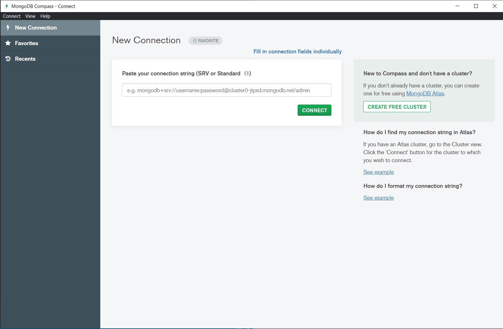

## Read Data MongoDB with GO

Untuk Membaca data dari database MongoDB menggunakan golang kita perlu membuat collection baru dan cukup menggunakan database local saja.

#### 1. Jalankan MongoDB Compass

Langsung saja pilih opsi Fill in conection fields individually untuk menjalankan secara local.

[Kembali](README.md)