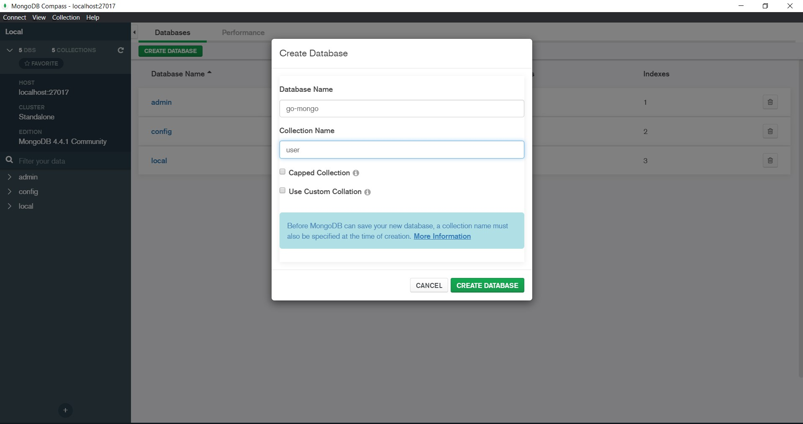
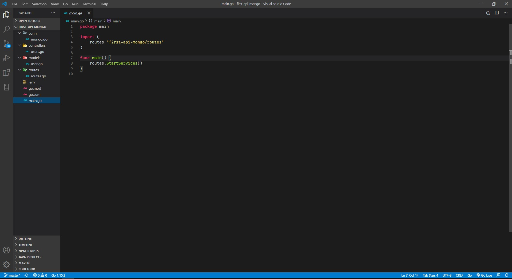

## Read Data MongoDB with GO Gin

Pada praktik ini kita akan membuat program restful api dengan menggunakan library go gin.

#### 1. Buat Program Go

Kita buat database terlebih dahulu berserta collectionnya.

Berikut ini tampilan database di mongodb dengan collection user dan data masih kosong.

Kemudian kita buat program untuk koneksi ke database mongodb dan host localhost yang mana data itu ada pada bagian .env

Kemudian kita buat model user dengan ketentuan yang berlaku dan buat satu fungsi untuk get data itu sendiri.

Selanjutnya kita buat routing untuk alamat urlnya seperti apa.

Nah, berikut ini isi dari .env

Kemudian pada main.go kita panggil fungsi routes.StartServices()

Selanjutnya buat controllers untuk menjawab masing-masing fungsi yang sudah dipanggil pada file routes tadi

#### 2. Testing Data

Jalankan program dengan cara menjalankan perintah go run main.go

Kemudian kita testing menggunakan postman dan untuk langkah pertama kita test method GET. Hasilnya memang kosong karena belum ada data sama sekali.

Selanjutnya kita coba method POST dimana kita hanya mengisikan Name, Address dan Age. Karena untuk ID, CreatedAt dan UpdatedAt sudah tergenrate menggunakan bson ObjectID dan time.Time

Kemudian kita coba get lagi dan yap data terbaru sudah muncul

Kita cek kedatabase mongodb menggunakan mongodb compass dan ternyata data terbaru sudah ada.

Berikut ini proses yang terjadi ketika kita test http method menggunakan postman.

[Kembali](README.md)