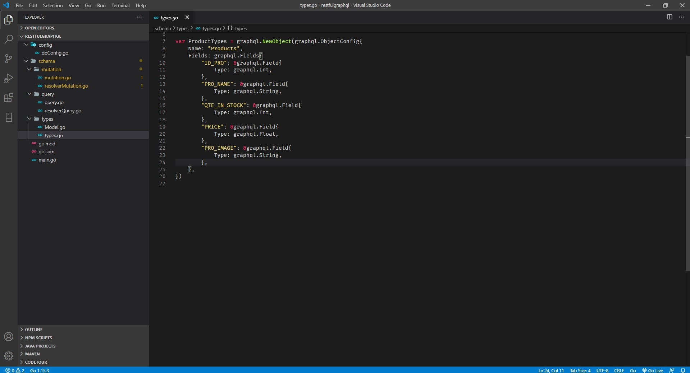

## Graphql Go on MySQL

Pada model ini kita membuat restful menggunakan konsep graphql yang artinya tidak memperdulikan http method dan cuma ada satu url api saja.

#### 1. Buat Program
Berikut ini struktur dari project ini

Kemudian membuat file main.go seperti berikut ini

Kemudian kita tentukan model typenya dari data tersebut.

Selanjutnya kita buat type untuk diconvert ke model graphql.

Kemudian kita buat file untuk query data dari database dan kemudian diconvert ke model graphql.

Selanjutnya hasil querynya kita simpan ke dalam resolver query supaya data yang kita query bisa ditampilkan.

Kemudian kita buat file mutation dimana file ini berfungsi untuk merubah ke dalam format graphql.

Untuk resolver mutation ini berfungsi sebagai query data.

Kemudian jangan lupa untuk menambahkan fungsi koneksi ke database mysql.

#### 2. Test Program

Setelah selesai membuat program kita jalankan program ini dengan menjalankan perintah go run main.go dan pada postman kita cek pada localhost:8088 dan server sudah up.

Kemudian kita cek ke database terlebih daulu pastikan sudah ada database dan table yang sesuai dengan program ini.

Kemudian kita coba get data dengan query menggunakan graphql seperti gambar dibawah ini.

Ketika post pun juga tetap menggunakan method get karena graphql tidak mengenal post, put ataupun delete. Semua jadi satu query.

Setelah berhasil menambahkan kita coba get all semua data yang ada di database mysql menggunaka query all.

Kemudian kita validasi di dataabase dan ternyata data terbaru sudah muncul.

**Sumber**
[Implementasi Graphl Mysql Golang](https://medium.com/@anggashela/implementasi-graphql-myql-golang-3cbe39712122)

[Kembali](README.md)