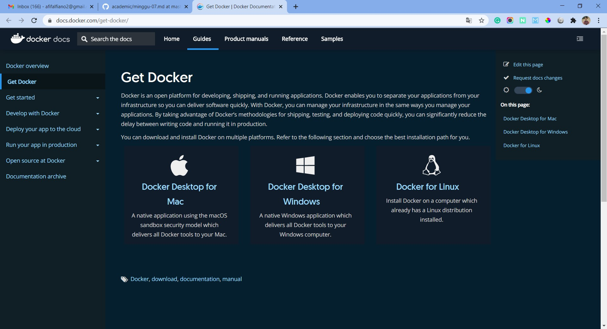
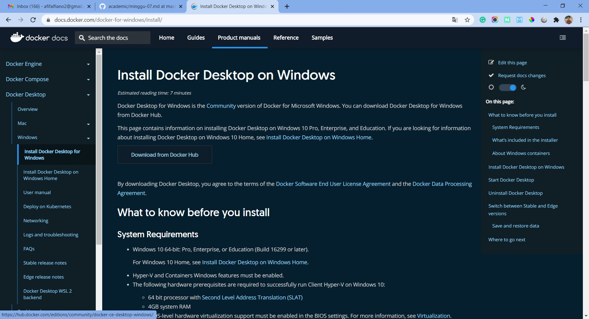
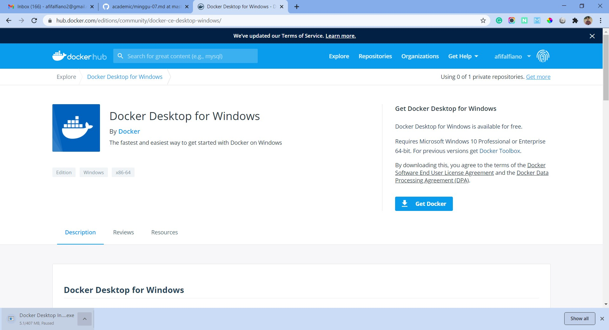
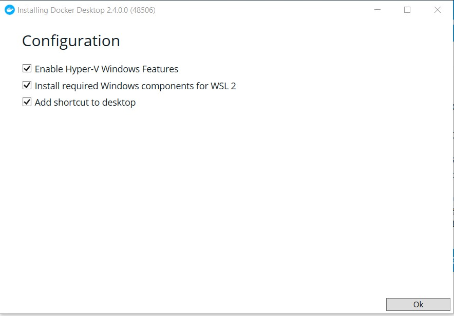
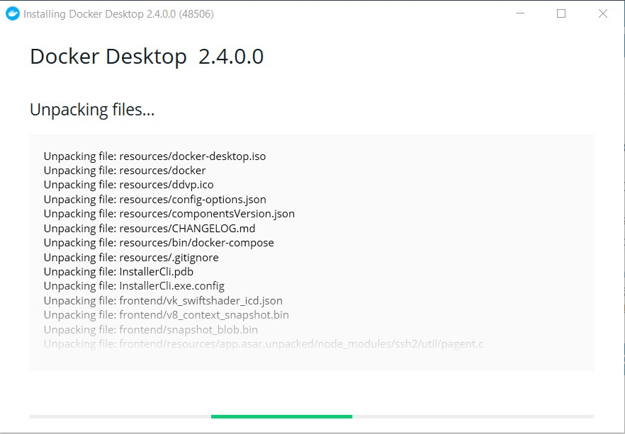
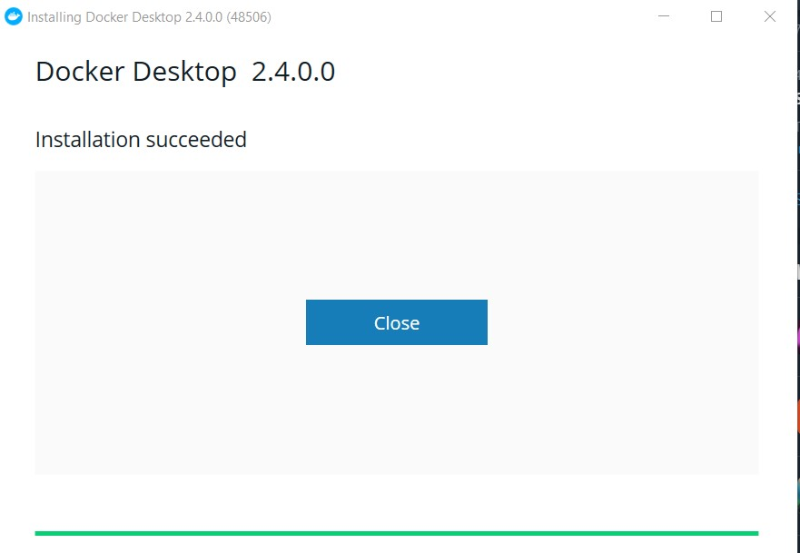

## Install Docker

Berikut ini cara menginstall docker di sistem operasi windows.

#### 1. Download Installer

Berikut ini terdapat informasi terkait bagaimana panduan untuk menginstall docker ini.

Kemudian terdapta link untuk download dan langsung diarahkan ke halmana berikut ini. Langsung saja klik Get Docker.

#### 2. Jalankan Installer

Setelah installer sudah terdownload langsung saja jalankan installer tersebut. 

Tuggu proses installasi karena memakan banyak waktu.

Yap. Proses installasi telah selesai.

Docker hub sudah bisa digunakan di sistem operasi windwos.

[Kembali](README.md)

