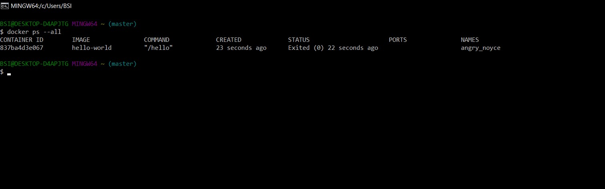

## Get Started with Docker

Setelah proses installasi berhasil maka kita bisa menggunakan docker ini untuk latihan.

#### 1. Hello World

Untuk mengecek versi docker yang digunakna jalankan perintah docker --version.

Kemudian untuk mencoba container yang ada pada docker langsung saja jalankan 
perintah docker run hello-world. Memang diawal kita tidak memiliki project hello-world, akan tetapi dokcer langsung menjadi image dari docker hub atau tempat dimana image open source berada.

Untuk melihat container atau image apa saja yang berjalan dimesin docker kita bisa jalankan perintah docker ps --all

#### 2. Test Project

Kita mencoba menggunakan project yang sudah ada untuk dideploy ke docker. Project tersebut kita clone dari github.

Kemudian masuk ke direktori tersebut dan jalankan proses docker build dengan perintah berikut ini docker build --tag bulletinboard:1.0 .

Pastika proses build project tersebut berhasil.

Kemudian untuk publish project ke dalam docker local kita dengan menjalankan perintah berikut ini docker run --publish 8000:8080 --detach --name bb bulletinboard:1.0.

Ketika publish akan dimintai akses untuk mengizinkan publish tersebut.

Untuk mengecek langsung saja cek lewat browse dengan mengetikan localhost:8080

Kemudian untuk menghapus project yang sudah ada didocker tinggal jalankan perintah docker rm --force nama_docker_project

### 3. Push Docker on Docker Hub

Sama halnya seperti github pada docker juga memilki tempat untuk meletakan kode kita di docker hub. Buat terebih dahulu repository.

Kemudian buat tag untuk project docker tersebut.

Setelah berhasil membuat tag langsung saja push project tersebut dengan perintah docker push nama_project:tag

Kemudian kita cek di docker hub dan sudah ada

[Kembali](README.md)

