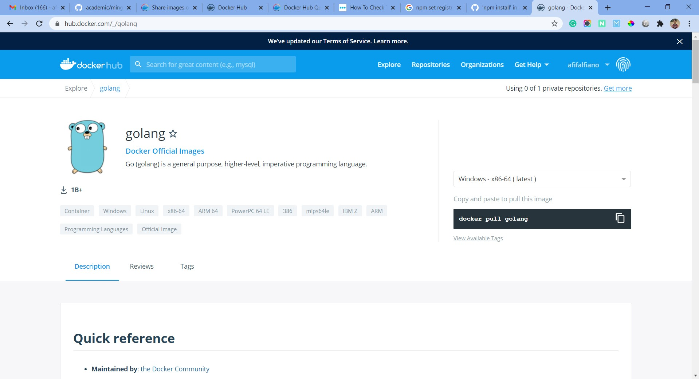

## Golang Image

Pada praktik ini kita coba menggunakan image golang yang sudah dipublish ke docker hub. Jadi kita tinggal menggunakannya saja.

#### 1. Cari Image Golang

Setelah mendapatkan golang image langsung saja lakukan docker pull golang di local kita.

Tunggu proses pull sampai selesai.

Kemudian coba jalankan golang image tersebut dengan perintah docker run golang.

Nah, pada kasus ini kita bisa coba membuat program dengan hello-world menggunakan docker dan publish ke image tersebut dengan harapan kita bisa requet api ke program tersebut melalui local kita baik menggunakan postman ataupun browser.

Buat program hello world

Kemudian build program golang tersebut.

[Kembali](README.md)