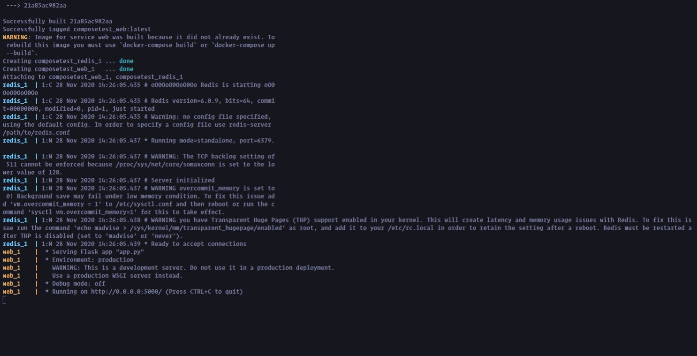
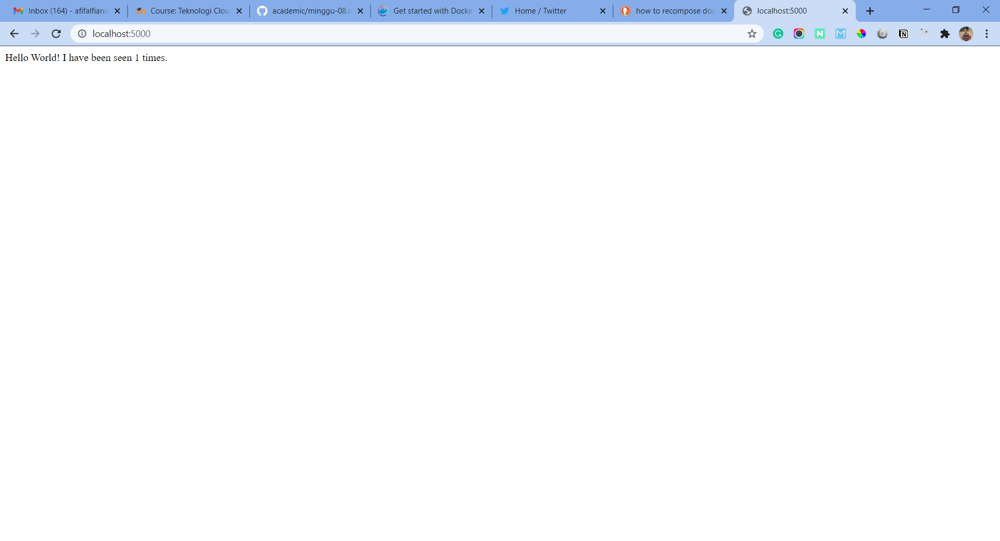

## Docker Compose

Hands on mencoba menggunakan docker compose dari situs resimnya.

#### 1. Membuat Kode App.py

Membuat kode seperti berikut ini 

#### 2. Membuat Dockerfile

Kemudian unutk kebutuhan docker compose kita perlu juga membuat dockerfile seperti berikut ini.

#### 3. Requirements.txt

Jangan lupa untuk membuat requirements.txt untuk digunakan lib apa saja yang akan diinstall.

#### 4. Membuat Docker-compose.yml

Nah kemudian kita buat juga docker-compose.yml untuk persyaratan supaya dapat terdeploy menggunakan docker-compose

#### 5. Jalankan Docker-compose up

Kemudian jalankan perintah docker-compose up untuk memulai proses build dan deploy.

Tunggu sampai proses seleai dan aka diinfokan project bisa diakses di localhost:5000

#### 6. Testing

Setelah itu kita coba di browser dan akases localhost:5000 , maka tampilannya akan seperti ini.

Kemudian kita cek docker image yang barusan kita buat sudah masuk list apa belum dengan cara menjalankan perintah docker image ls

#### 7. Membuat Environment untukk Auto Reload Project

Kita tambahkan konfigurasi pada docker-compose.yml dengan menambahkan environment FLASK_NEW: development. 

Simpan dan jalankan kembali docker-compose up

Kemudian kita edit app.py.

Maka ketika kita langsung menyimpan otomatis akan langsung reload dengan yang terbaru.

#### 8. Docker Compose List

Untuk mengecek docker compose yang sedang berjalan bisa dengan menjalankan perintah docker-compose ps

Kemudian untuk menjalankan environment dev bisa jalankan perintah docker-compose run web env

#### 9. Stop Docker Compose

Untuk mengehtikan service dari docker compose bisa jalankan perintah docker-compose stop

#### 10. Menghapus Docker Compose

Kemudian untuk menghapus container hasil dari docker compose bisa jalankna perintah docker-compose down --volumes

[Kembali](README.md)