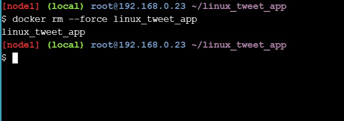

## Docker For Beginner

Tujuan dari hands on lab ini adalah untuk memahami basic docker commands dan workflow pembuatan aplikasi sederhana.

Sebelumnya pastikan log-in to access bisa menggunakan akun Docker.

#### 1. Clone Project

Pastikan terminal sudah bisa digunakan seperti berikut ini.

<div align="left">

</div>

Setelah bisa masuk ke terimnal clone project berikut ini ```git clone https://github.com/dockersamples/linux_tweet_app```

<div align="left">

</div>

#### 2. Run Simple Docker Containers

Mencoba menjalankan container alpine linux dengan menjalankan perintah ```docker container run alpine hostname```

<div align="left">

</div>

Kemudian mengecek daftar container yang sedang berjalan dibackground dengan menjalankan perintah ```docker container ls --all```

<div align="left">

</div>


#### 3. Run an interactive Ubuntu Container

Kita juga bisa menjalankan distro linux yang berbeda, misalkan disini kita coba jalankan ubuntu dengan coba config menggunakan bash dari ubuntu. Jalankan perintah ```docker container run --interactive --tty --rm ubuntu bash```

<div align="left">

</div>

Nah, otomatis kita akan masuk ke terminal ubuntu yang sebelumnya telah kita pull. Untuk mengecek versi yang digunakan tinggal jalankan perintah cat /etc/issue. Kemudian kita coba exit

<div align="left">

</div>

Kembali ke terminal awal dan kita coba jalankan perintah ```cat /etc/issue``` maka isinya sudah bukan ubuntu melainkan alpine.

<div align="left">

</div>

#### 4. Run a background MySQL container

Kita juga bisa menjalankan mysql container seperti berikut ini. Cukup jalankan perintah berikut ini 
```
 docker container run \
 --detach \
 --name mydb \
 -e MYSQL_ROOT_PASSWORD=my-secret-pw \
 mysql:latest
 ```

<div align="left">

</div>

Maka secara otomatis akan pull container mysql dan akan dipull versi terbaru dan kita cek lagi container apa saja yang berjalan di background dengan menjalankan perintah docker container ls

<div align="left">

</div>

Selain itu kita juga bisa mengecek log apa saja yang terjadi pada suatu container yang ada di mesin kita. Cukup jalankan perintah ```docker container logs mydb```

<div align="left">

</div>

Kemudian untuk mengecek mysql daemon yang berjalan bisa jalankan perintah ```docker container top mydb```

<div align="left">

</div>

Kita juga bisa masuk ke shell dari mysql tersebut dengan mengkonfigurasi terlebih dahulu seperti berikut ini 
``` docker exec -it mydb mysql --user=root --password=$MYSQL_ROOT_PASSWORD --version ```

<div align="left">

</div>

Setelah itu tinggal connect ke shell mysql container dengan menjalankan perintah ```docker exec -it mydb sh```

Kemudian untuk mengecek versi yang sedang berjalan bisa menggunakan perintah yang sama hanya saja kali ini dari session shel yang baru di dalam container.
``` mysql --user=root --password=$MYSQL_ROOT_PASSWORD --version```

<div align="left">

</div>

#### 5. Package and run a custom app using Docker

Pada bab ini kita kaan belajar memanage project kita menggunakan dockerfile. Kita masuk ke direktori linux_tweet_app yang tadi telah kita clone. 

Kemudian untuk melihat config dockerfile tinggal jalankan perintah ```cat Dockerfile```

<div align="left">

</div>

Kemudian kita export terlebih dahulu DOCKERID kita 
```export DOKCKERID=<your docker id>```

Untuk mengecek apakah sudah ada id apa belum jalankan ```echo $DOCKERID```

<div align="left">

</div>

Tinggal build image tersebut dengan perintah 
```docker image buld --tag $DOCKERID/linux_tweet_app:1.0 .```

<div align="left">

</div>

Setelah berhasil build jalankan container tersebut dengan perintah berikut ini 
```
docker container run \
 --detach \
 --publish 80:80 \
 --name linux_tweet_app \
 $DOCKERID/linux_tweet_app:1.0

```

<div align="left">

</div>

Pada intrusksi tutorial kita bisa melihat project yang sudah di build atau dijalankan dengan klik link tersebut dan hasilnya seperti ini.

<div align="left">

</div>

Kemudian untuk menghapus container tinggal jalankan perintah berikut ini
``` docker container rm --force linux_tweet_app ```

<div align="left">

</div>


#### 6. Modify a running website

Memodifikasi website yang telah berjalan dengan konfigurasi seperti berikut ini
```
 docker container run \
 --detach \
 --publish 80:80 \
 --name linux_tweet_app \
 --mount type=bind,source="$(pwd)",target=/usr/share/nginx/html \
 $DOCKERID/linux_tweet_app:1.0

```

<div align="left">

</div>

Perintah diatas sekaligus menjalankan website project kita

<div align="left">

</div>

Kemudian copy file index-new.html dan mereplace index.html
``` cp index-new.html index.html```

<div align="left">

</div>

Maka otomatis website berubah menjadi versi terbaru.

<div align="left">

</div>

Untuk menghapus container tinggal jalankan perintah berikut ini
```docker rm --force linux_tweet_app ```

<div align="left">

</div>

Kemudian jalankan kembali container tanpa binding mount

<div align="left">

</div>

Maka hasilnya seperti ini karena kembali ke kondisi awal

<div align="left">

</div>

Kemudian stop dan hapus kembali container tersebut dengan menjalankan perintah berikut ini 
``` docker rm --force linux_tweet_app```

<div align="left">

</div>

#### 7. Update the image

Untuk memperbarui image artinya kita perlu rebuild kembali project tersebut dengan versi yang berbeda dengan menjalankan perintah berikut ini.
``` docker image build --tag $DOCKERID/linux_tweet_app:2.0 .```

<div align="left">

</div>

Kemudian unutk mengecek image apa saja yang ada di mesin kita tinggal jalankan seperti berikut ini
``` docker image ls ```

<div align="left">

</div>

#### 8. Test the new version

Kita mencoba menjalakan versi terbaru dari linux_tweet_app dengna menjalankan perintah berikut ini
```
docker container run \
 --detach \
 --publish 80:80 \
 --name linux_tweet_app \
 $DOCKERID/linux_tweet_app:2
```

<div align="left">

</div>

Kemudian kita cek versi terbaru tersebut dengan klik tautan yang telah disediakan di courses tersebut.

<div align="left">

</div>

Selain itu kita juga bisa menjalankan container lain. Artinya kita bisa menjalankan beberapa container di waktu yang bersamaan.

Berikut ini perintah untuk menjalankan container project pertama.

```
 docker container run \
 --detach \
 --publish 8080:80 \
 --name old_linux_tweet_app \
 $DOCKERID/linux_tweet_app:1.0 
 
 ```

<div align="left">

</div>

Kemudian kita cek lagi versi lama yang ada dicontainer pertama.

<div align="left">

</div>

#### 9. Push your images to Docker Hub

Yap, setelah mengikuti courses dari awal sampailah kita pada bab push image ke docker hub kita. Cukup jalankan perintah berikut ini
```  docker image ls -f reference="$DOCKERID/*" ```

<div align="left">

</div>


Pastika kita sudah login ke terminal tersebut. Jika belum maka bisa jalankan perintah docker login. Setelah berhasil login tinggal jalankan perintah berikut ini ``` docker image push $DOCKERID/linux_tweet_app:1.0

<div align="left">

</div>

Tunggu proses push sampai selesai. 

Untuk memastikan apakah sudah tersimpan di docker hub kita apa belum bisa langsung cek di docker hub kita.

<div align="left">

</div>

[Kembali](README.md)