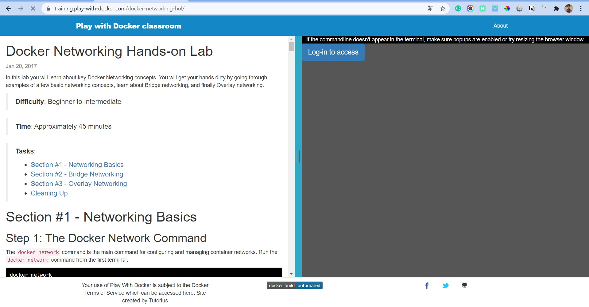
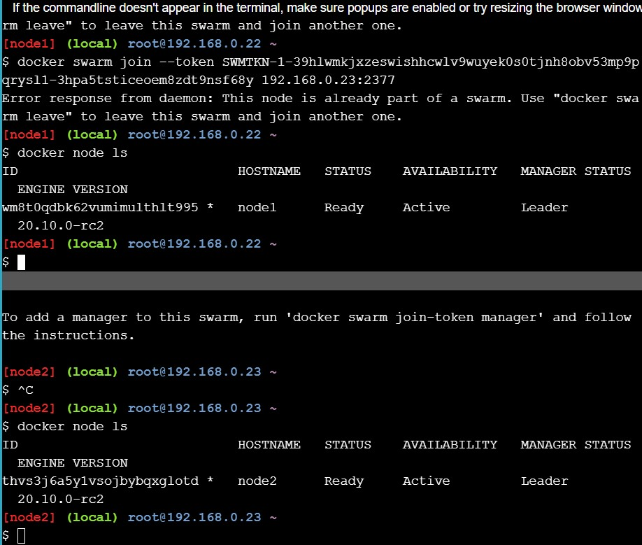
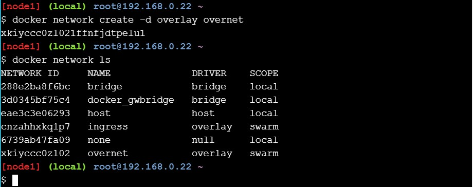

## Docker Networking Hands-on Lab

Tujuan dari hands on lab ini adalah untuk memahami konsep networking pada docker

#### 1. Networking Basics

Sebelumnya pastikan log-in to access bisa menggunakan akun Docker.

<div align="left">

</div>

Pastikan terminal sudah bisa digunakan seperti berikut ini.

<div align="left">

</div>

Perintah dasar dari docker untuk melihat konfigurasi network bisa dengan menjalankan perintah ```docker network```

<div align="left">

</div>

Kemudian untuk melihat list network apa saja yang terhubung dengan terminal tersebut bisa jalankan perintah berikut ini ```docker network ls```

<div align="left">

</div>

Selain itu kita juga bisa melakukan inspect sebuah network atau istilahnya ingin melihat detail dari sebuah network. Cukup jalankan perintah ```docker network inspect brdige```

<div align="left">

</div>

Juga kita dapat melihat plugin apa saja yang digunakan pada suatu network di docker dengan menjalankan perintah ```docker info```

<div align="left">

</div>

#### 2. Bridge Networking

Setiap instalasi sebuah docker akan menggunakan prebuild network yang dkenal dengan bridge. Untuk mengecek bridge tinggal jalankan perintah ```docker network ls```

<div align="left">

</div>

Untuk menggunakan linux bridges di docker host kita dapat menginstall brctl dengan menjalankan perintah 
```
apk update
apk add bridge
brctl show
```

<div align="left">

</div>

Maka ketika show brctl akan tampil brdige id dan nama bridge seperti berikut ini

<div align="left">

</div>

Untuk melihat ip address dari docker host kita bisa menjalankan perintah ```ip a```

<div align="left">

</div>

#### Connect Container

Network bridge defaultnya digunakan untuk kontainer baru. Jadi ini tidak akan beguna ketika menggunakan network yang berbeda.

Kita coba membuat kontainer baru dengan menjalankan perintah ```docker run --dt ubuntu sleep infinity .```

<div align="left">

</div>

Kemudian kita cek kontainer yang telah kita buat dengan menjalankan perintah ```docker ps```

<div align="left">

</div>

<div align="left">

</div>

Selanjutnya kita inspect kembali kontainer baru degan menjalankan perintah ```docker network inspect bridge```

<div align="left">

</div>

Kemudian kita test koneksi dengan melakukan ping ke ip berikut ini ```ping -c5 <ipv4>```

<div align="left">

</div>

Kita coba masuk ke kontainer terbaru dengan melakukan docker exec atau lengkapnya seperti berikut ini ```docker exec --it containerid /bin/bash```

<div align="left">

</div>

<div align="left">

</div>

Kemudian setelah berhasil masuk ke kontainer tersebut install iputils-ping. Berikut ini perintah lengkapnya ```apt-get udpate && apt-get install -y iputils-ping```

Kemudian dari kontainer tersebut kita coba ping ke sebuah website. contohhnya github.com

<div align="left">

</div>

Kemudian kita keluar dari kontainer tersebut dan menghentikan kontainer tersebut

<div align="left">

</div>


#### Configure NAT for external connectivity

Pada bab ini kita akan mencoba menjalankan nginx kontainer dangan port 8080 didalam sebuah docker host yang memliki port 80.

Seperti biasa kita langsung jalankan saja perintah berikut ini
``` docker run --name web1 -d -p 8080:80 nginx``` 

<div align="left">

</div>

Kemudian kita cek kontainer tersebut dengan menjalankan perintah ```docker ps```

<div align="left">

</div>

Kemudian kita coba cek dengan ```curl 127.0.0.1:8080```

<div align="left">

</div>

#### 3. Overlay Networking

Pada bab ini kita akan mencoba docker swarm
```docker swarm init --advertise--addr $(hostname -i)```

<div align="left">

</div>

Kemudian diterminal satunya kita join ke swarm tersebut dengan token yang sudah tergenerate di terminal pertama

<div align="left">

</div>

Kemudian cek docker swarm yang telah join
```docker node ls```

<div align="left">

</div>

#### Craete an overlay network

Kita coba membuat sebuah overlay network didalam sebuah docker swarm.
``` docker network create -d overlay overnet```

<div align="left">

</div>

Kemudian cek ```docker network ls```

<div align="left">

</div>

Di terminal satunya cek kembali ```docker network ls```

<div align="left">

</div>

Ternyata di terminal satunya overnet tidak ada. Ini dikarenakan docker hanya akan extends overlay network ke host ketika mereka dibutuhkan. 

Untuk mengecek kita bisa jalankan perintah ```docker network inspect overnet```

<div align="left">

</div>

#### Create a service

Sekarang kita coba membuat sebuah service didalam docker swarm

```
docker service create --name myservice \
--network overnet \
--replicas 2 \
ubuntu sleep infinity
```

<div align="left">

</div>

Setelah itu kita cek service yang ada dan ternyata dia mereplikas sebanyak 2 service

<div align="left">

</div>

Untuk lebih rincinya kita bisa cek dengan menjalankan perintah ```docker service ps myservice```

<div align="left">

</div>

Kemudian kita cek kembali diterminal kedua untuk network overlay overnet apakah sudah ada apa belum dengan perintah ```docker network ls```

<div align="left">

</div>

Ternyata sudah ada dan untuk detailnya kita bisa inspect network tersebut dengan menjalanakan perintah ```docker network inspect overnet```

<div align="left">

</div>

#### Test the network

Setelah melakukan inspect overnet kita akan coba test koneksi. Sebelumnya kita cek terlebih dahulu kontainer apa saja yang tersedia dengan perintah ```docker ps```

<div align="left">

</div>

Kemudian kita remote kontainer tersebut dan install iputils-ping

<div align="left">

</div>

Ternyata tidak ada respons dan kita perlu melakukan konfig tambahan.

<div align="left">

</div>

#### Test service discovery

Kemudian ktia cek dahulu resolv.conf yang ada dengan perintah
``` cat /etc/resolv.conf```

<div align="left">

</div>


Kemudian kita ping service yang telah kita buat dari kontainer tersebut
```ping -c5 myservice```

<div align="left">

</div>

Sekali lagi kita inspect service yang telah kita buat dengan perintah ```docker service insepect myservice```

<div align="left">

</div>

Kemudian kita cek lagi kontainer apa saja yang telah ready

<div align="left">

</div>

Selanjutnya kita hentikan atau kill kontainer yang ada untuk mengehamat resource dengan perintah ```docker kill containerid```

<div align="left">

</div>

Kemudian kita cek lagi ```docker ps``` dan pastikan sudah tidak ada list kontainer yang masih ready

<div align="left">

</div>

Untuk mengakhiri docker swarm tinggal jalankan perintah ```docker swarm leave --force```

<div align="left">

</div>

[Kembali](README.md)