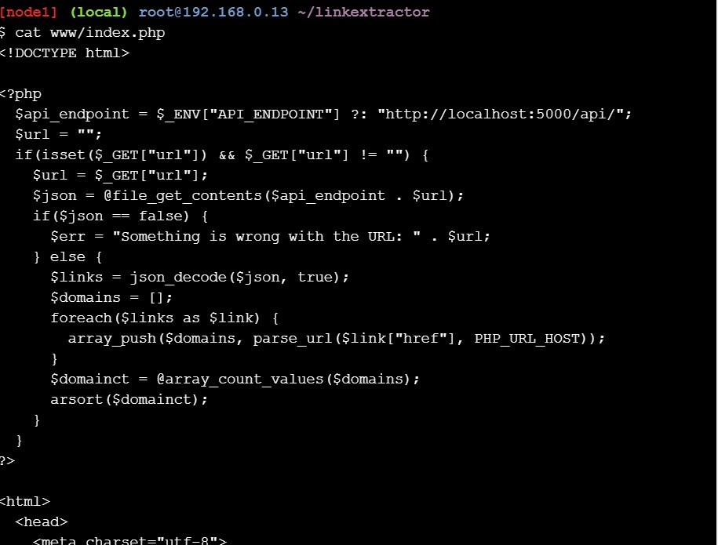
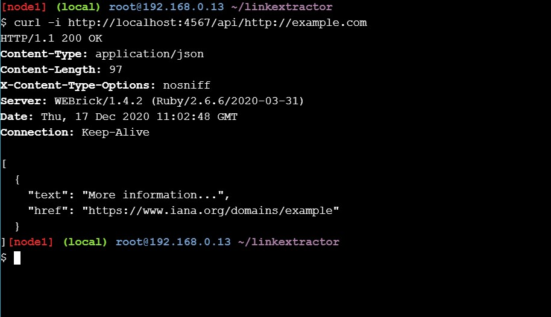

## Application Contianerization and Microservice Orchestration

Tujuan dari hands on lab ini adalah untuk memahami konsep Application Contianerization and Microservice Orchestration

[Kembali](README.md)